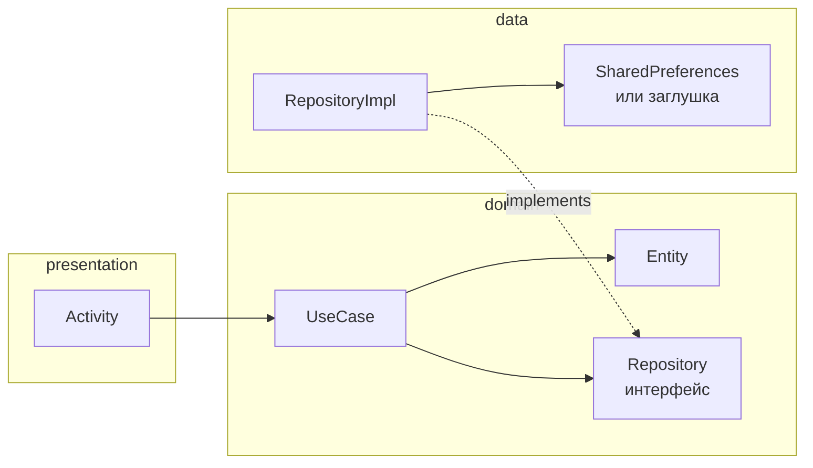
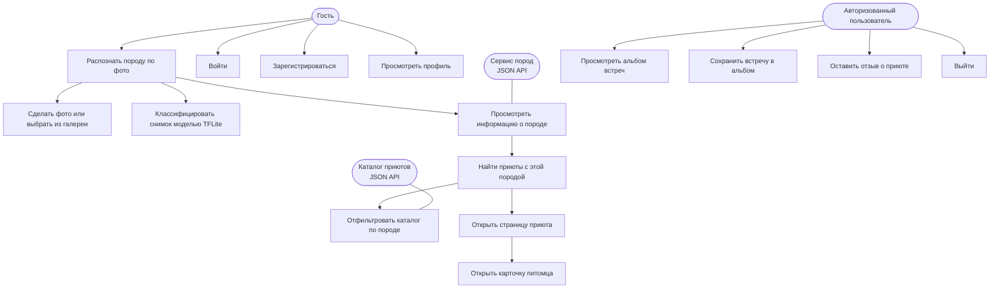
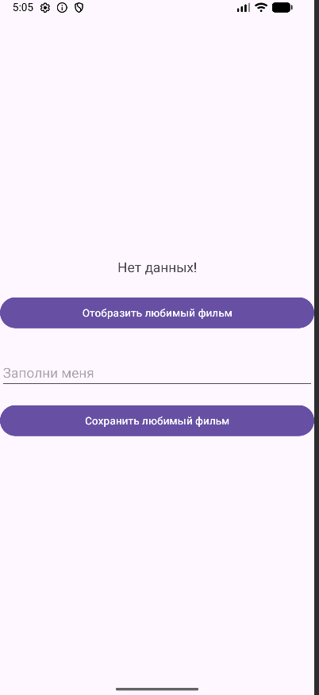
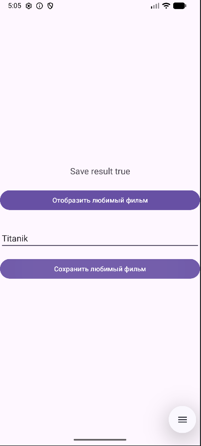
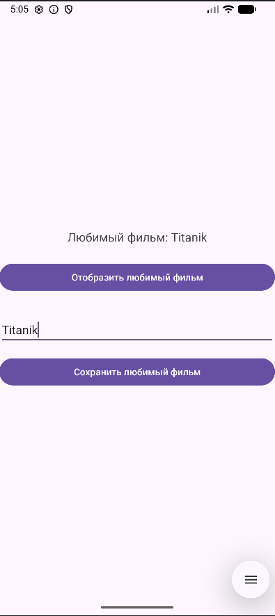
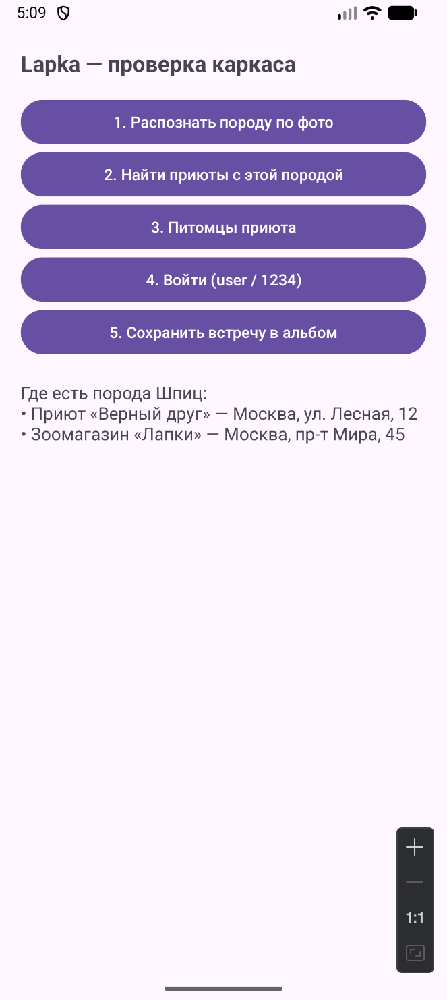

# Практическая работа № 1
### Clean Architecture в Android

Язык реализации — **Java**

| | |
|---|---|
| Студент | Иванов Раул Рашадович БСБО-09-23 |
| Пакет MovieProject | `ru.mirea.ivanovrr.lesson9` |
| Пакет своего приложения | `ru.mirea.ivanovrr.lapka` |

---

## Содержание

- [Что требовалось](#что-требовалось)
- [Слои](#слои)
- [1. Проектирование Lapka](#1-проектирование-lapka)
- [2. MovieProject](#2-movieproject)
- [3. Болванка Lapka](#3-болванка-lapka)
- [Соответствие методичке](#соответствие-методичке)

---

## Что требовалось

| § | Задание | Где в репозитории |
|---|---------|-------------------|
| 1.1 | Диаграмма use case своего приложения | [`Lapka/Lapka_UseCase.drawio`](Lapka/Lapka_UseCase.drawio) |
| 1.2 | Экраны и зоны ответственности слоёв | [`Lapka/Lapka_Screens_Layers.drawio`](Lapka/Lapka_Screens_Layers.drawio) |
| 2 | Учебный проект любимого фильма + SharedPreferences | [`MovieProject/`](MovieProject/) |
| 3 | Болванка своего приложения, use case + тестовые данные | [`Lapka/`](Lapka/) |

На весь курс в приложение заложены: вход и регистрация, обращение к JSON-сервису, локальная БД, список сущностей с картинками, страница сущности, разный функционал у гостя и пользователя, модель TensorFlow Lite. **В этой работе** сделаны проектирование и каркас. Реальные Retrofit, Room и `.tflite` — предмет следующих занятий.

---

## Слои

Зависимости смотрят строго **к центру**. Экран знает только про use case, use case — только про интерфейс репозитория. Конкретная реализация вместе с `Context` остаётся в `data`.



| Слой | Содержимое | Зависимости |
|------|------------|-------------|
| `presentation` | Activity, разметка, сборка зависимостей | только `domain` (объект `*Impl` создаётся здесь, как в листинге методички) |
| `domain` | Entity, UseCase, интерфейс Repository | ни от кого, ни одного `import android.*` |
| `data` | `RepositoryImpl`, источник данных | `domain` |

Соблюдение правила проверяется в лоб: каталог `domain` компилируется обычным `javac` без Android SDK.

---

## 1. Проектирование Lapka

**Lapka** — определитель породы по фотографии. Человек фотографирует встреченное животное, приложение называет породу, после чего показывает приюты и зоомагазины, где есть такая же, вплоть до карточки конкретного щенка с кличкой и возрастом. Гость распознаёт и смотрит каталог, авторизованный пользователь ведёт альбом встреч и оставляет отзывы.

Исходники диаграмм: draw.io. Ниже — та же схема, GitHub рисует её сам.

### Акторы и сценарии



Связи из UML-диаграммы:

- авторизованный пользователь **обобщает** гостя и умеет всё то же самое плюс своё;
- распознавание **include** снимок, прогон через модель и карточку породы; поиск приютов **include** фильтрацию каталога;
- поиск приютов, страница приюта, карточка питомца, сохранение встречи, отзыв и выход — **extend**.

### Экраны

| Экран | Кто | Use case |
|-------|-----|----------|
| Вход / регистрация | все | `LoginUseCase`, `RegisterUseCase` |
| Распознать породу | все | `RecognizeBreedUseCase` |
| Карточка породы | все; сохранение — после входа | `GetBreedInfoUseCase`, `SaveEncounterUseCase` |
| Приюты и магазины | все | `GetSheltersByBreedUseCase` |
| Страница приюта | все; отзыв — после входа | `GetShelterDetailsUseCase`, `GetPetsByShelterUseCase`, `AddReviewUseCase` |
| Карточка питомца | все | `GetPetDetailsUseCase` |
| Мой альбом встреч | пользователь | `GetEncountersUseCase`, `DeleteEncounterUseCase` |
| Профиль | все, содержимое разное | `GetProfileUseCase`, `LogoutUseCase` |

Правило: экран ходит только в `domain`. `Context`, SharedPreferences, Room, Retrofit, TFLite — в `data`.

---

## 2. MovieProject

Учебный пример из §2. Пакет `ru.mirea.ivanovrr.lesson9`.

```
MovieProject/app/src/main/java/ru/mirea/ivanovrr/lesson9/
├── presentation/
│   └── MainActivity.java
├── domain/
│   ├── models/Movie.java
│   ├── repository/MovieRepository.java
│   └── usecases/
│       ├── GetFavoriteFilmUseCase.java
│       └── SaveMovieToFavoriteUseCase.java
└── data/repository/
    └── MovieRepositoryImpl.java
```

### Скриншоты

<p align="center">
  
  
  
</p>

<p align="center">
  <sub>Слева — запуск без данных («Нет данных!»). В центре — запись в SharedPreferences. Справа — чтение названия обратно.</sub>
</p>

### Layout

Идентификаторы как в методичке: `textViewMovie`, `buttonGetMovie`, `editTextMovie`, `buttonSaveMovie`.

```xml
<?xml version="1.0" encoding="utf-8"?>
<LinearLayout xmlns:android="http://schemas.android.com/apk/res/android"
    android:id="@+id/main"
    android:layout_width="match_parent"
    android:layout_height="match_parent"
    android:orientation="vertical"
    android:gravity="center"
    android:padding="24dp">

    <TextView
        android:id="@+id/textViewMovie"
        android:layout_width="match_parent"
        android:layout_height="wrap_content"
        android:layout_marginBottom="24dp"
        android:gravity="center"
        android:text="Нет данных!"
        android:textSize="18sp" />

    <Button
        android:id="@+id/buttonGetMovie"
        android:layout_width="match_parent"
        android:layout_height="wrap_content"
        android:layout_marginBottom="32dp"
        android:text="Отобразить любимый фильм" />

    <EditText
        android:id="@+id/editTextMovie"
        android:layout_width="match_parent"
        android:layout_height="wrap_content"
        android:layout_marginBottom="16dp"
        android:hint="Заполни меня"
        android:inputType="text" />

    <Button
        android:id="@+id/buttonSaveMovie"
        android:layout_width="match_parent"
        android:layout_height="wrap_content"
        android:text="Сохранить любимый фильм" />

</LinearLayout>
```

### Domain

Сущность и контракт репозитория — без единого обращения к Android API.

```java
package ru.mirea.ivanovrr.lesson9.domain.models;

public class Movie {

    private final int id;
    private final String name;

    public Movie(int id, String name) {
        this.id = id;
        this.name = name;
    }

    public int getId() { return id; }
    public String getName() { return name; }
}
```

```java
package ru.mirea.ivanovrr.lesson9.domain.repository;

import ru.mirea.ivanovrr.lesson9.domain.models.Movie;

public interface MovieRepository {

    boolean saveMovie(Movie movie);

    Movie getMovie();
}
```

Use case получает репозиторий в конструкторе. Правило «пустое название не сохраняем» стоит здесь, а не в хранилище.

```java
package ru.mirea.ivanovrr.lesson9.domain.usecases;

import ru.mirea.ivanovrr.lesson9.domain.models.Movie;
import ru.mirea.ivanovrr.lesson9.domain.repository.MovieRepository;

public class SaveMovieToFavoriteUseCase {

    private final MovieRepository movieRepository;

    public SaveMovieToFavoriteUseCase(MovieRepository movieRepository) {
        this.movieRepository = movieRepository;
    }

    public boolean execute(Movie movie) {
        if (movie == null || movie.getName() == null || movie.getName().trim().isEmpty()) {
            return false;
        }
        return movieRepository.saveMovie(movie);
    }
}
```

```java
package ru.mirea.ivanovrr.lesson9.domain.usecases;

import ru.mirea.ivanovrr.lesson9.domain.models.Movie;
import ru.mirea.ivanovrr.lesson9.domain.repository.MovieRepository;

public class GetFavoriteFilmUseCase {

    private final MovieRepository movieRepository;

    public GetFavoriteFilmUseCase(MovieRepository movieRepository) {
        this.movieRepository = movieRepository;
    }

    public Movie execute() {
        return movieRepository.getMovie();
    }
}
```

### Data — SharedPreferences

`Context` появляется только тут. В domain его нет. Внутри берётся `applicationContext`, чтобы не удерживать Activity.

```java
package ru.mirea.ivanovrr.lesson9.data.repository;

import android.content.Context;
import android.content.SharedPreferences;

import ru.mirea.ivanovrr.lesson9.domain.models.Movie;
import ru.mirea.ivanovrr.lesson9.domain.repository.MovieRepository;

public class MovieRepositoryImpl implements MovieRepository {

    private static final String PREFS_NAME = "movie_prefs";
    private static final String KEY_MOVIE_ID = "movie_id";
    private static final String KEY_MOVIE_NAME = "movie_name";

    private final SharedPreferences preferences;

    public MovieRepositoryImpl(Context context) {
        this.preferences = context.getApplicationContext()
                .getSharedPreferences(PREFS_NAME, Context.MODE_PRIVATE);
    }

    @Override
    public boolean saveMovie(Movie movie) {
        if (movie == null || movie.getName() == null || movie.getName().trim().isEmpty()) {
            return false;
        }
        preferences.edit()
                .putInt(KEY_MOVIE_ID, movie.getId())
                .putString(KEY_MOVIE_NAME, movie.getName())
                .apply();
        return true;
    }

    @Override
    public Movie getMovie() {
        String name = preferences.getString(KEY_MOVIE_NAME, null);
        if (name == null) {
            return null;
        }
        return new Movie(preferences.getInt(KEY_MOVIE_ID, 0), name);
    }
}
```

### Presentation

Реализация создаётся в Activity и передаётся в use case — как в листинге методички (`new MovieRepositoryImpl(this)`).

```java
package ru.mirea.ivanovrr.lesson9.presentation;

public class MainActivity extends AppCompatActivity {

    private GetFavoriteFilmUseCase getFavoriteFilmUseCase;
    private SaveMovieToFavoriteUseCase saveMovieToFavoriteUseCase;

    @Override
    protected void onCreate(Bundle savedInstanceState) {
        super.onCreate(savedInstanceState);
        setContentView(R.layout.activity_main);

        MovieRepository movieRepository = new MovieRepositoryImpl(this);
        getFavoriteFilmUseCase = new GetFavoriteFilmUseCase(movieRepository);
        saveMovieToFavoriteUseCase = new SaveMovieToFavoriteUseCase(movieRepository);

        EditText editTextMovie = findViewById(R.id.editTextMovie);
        TextView textViewMovie = findViewById(R.id.textViewMovie);

        findViewById(R.id.buttonSaveMovie).setOnClickListener(view -> {
            Movie movie = new Movie(2, editTextMovie.getText().toString());
            boolean result = saveMovieToFavoriteUseCase.execute(movie);
            textViewMovie.setText(String.format("Save result %s", result));
        });

        findViewById(R.id.buttonGetMovie).setOnClickListener(view -> {
            Movie movie = getFavoriteFilmUseCase.execute();
            if (movie == null) {
                textViewMovie.setText("Нет данных!");
            } else {
                textViewMovie.setText(String.format("Любимый фильм: %s", movie.getName()));
            }
        });
    }
}
```

Пустое поле → `Save result false`. Заполненное → `true`. «Отобразить» читает SharedPreferences, поэтому название переживает перезапуск приложения; если ничего не сохраняли — снова «Нет данных!».

---

## 3. Болванка Lapka

Контрольное задание §3: Empty Views Activity, use case с этапа проектирования, репозитории отдают **тестовые данные**. Один экран.

```
Lapka/app/src/main/java/ru/mirea/ivanovrr/lapka/
├── presentation/MainActivity.java
├── domain/
│   ├── models/        User, Breed, RecognitionResult, Shelter, Pet, Encounter, Review
│   ├── repository/    7 интерфейсов
│   └── usecases/      14 классов
└── data/repository/   7 *Impl
```

### Скриншот

<p align="center">
  
</p>

<p align="center">
  <sub>Кнопка вызывает use case. На экран попадают заглушки: порода <code>Шпиц</code>, приюты с этой породой, питомцы приюта.</sub>
</p>

### Use case’ы (как на диаграмме)

| Класс | Слой |
|-------|------|
| `LoginUseCase`, `RegisterUseCase`, `GetProfileUseCase`, `LogoutUseCase` | domain |
| `RecognizeBreedUseCase`, `GetBreedInfoUseCase` | domain |
| `GetSheltersByBreedUseCase`, `GetShelterDetailsUseCase` | domain |
| `GetPetsByShelterUseCase`, `GetPetDetailsUseCase` | domain |
| `SaveEncounterUseCase`, `GetEncountersUseCase`, `DeleteEncounterUseCase`, `AddReviewUseCase` | domain |
| `AuthRepository`, `BreedRecognitionRepository`, `BreedRepository`, `ShelterRepository`, `PetRepository`, `EncounterRepository`, `ReviewRepository` | domain (интерфейс) |
| `*Impl` | data |

### Entity и интерфейс

```java
package ru.mirea.ivanovrr.lapka.domain.models;

public class Pet {

    private final String id;
    private final String shelterId;
    private final String name;
    private final String breedName;
    private final int ageMonths;
    private final String gender;
    private final String imageUrl;
    private final String description;

    public Pet(String id, String shelterId, String name, String breedName, int ageMonths,
               String gender, String imageUrl, String description) {
        this.id = id;
        this.shelterId = shelterId;
        this.name = name;
        this.breedName = breedName;
        this.ageMonths = ageMonths;
        this.gender = gender;
        this.imageUrl = imageUrl;
        this.description = description;
    }

    public String getId() { return id; }
    public String getShelterId() { return shelterId; }
    public String getName() { return name; }
    public String getBreedName() { return breedName; }
    public int getAgeMonths() { return ageMonths; }
    public String getGender() { return gender; }
    public String getImageUrl() { return imageUrl; }
    public String getDescription() { return description; }
}
```

```java
package ru.mirea.ivanovrr.lapka.domain.repository;

import java.util.List;

import ru.mirea.ivanovrr.lapka.domain.models.Shelter;

public interface ShelterRepository {
    List<Shelter> getSheltersByBreed(String breedName);
    Shelter getShelterById(String shelterId);
}
```

Порог уверенности модели — требование предметной области, поэтому проверка живёт в сценарии, а не в репозитории.

```java
package ru.mirea.ivanovrr.lapka.domain.usecases;

import ru.mirea.ivanovrr.lapka.domain.models.RecognitionResult;
import ru.mirea.ivanovrr.lapka.domain.repository.BreedRecognitionRepository;

public class RecognizeBreedUseCase {

    private static final float MIN_CONFIDENCE = 0.5f;

    private final BreedRecognitionRepository recognitionRepository;

    public RecognizeBreedUseCase(BreedRecognitionRepository recognitionRepository) {
        this.recognitionRepository = recognitionRepository;
    }

    public RecognitionResult execute(String photoUri) {
        if (photoUri == null || photoUri.trim().isEmpty()) {
            return null;
        }
        RecognitionResult result = recognitionRepository.recognize(photoUri);
        if (result == null || result.getConfidence() < MIN_CONFIDENCE) {
            return null;
        }
        return result;
    }
}
```

Там же проверяется разница прав: сохранить встречу можно только при активной сессии.

```java
public class SaveEncounterUseCase {

    private final EncounterRepository encounterRepository;
    private final AuthRepository authRepository;

    public SaveEncounterUseCase(EncounterRepository encounterRepository,
                                AuthRepository authRepository) {
        this.encounterRepository = encounterRepository;
        this.authRepository = authRepository;
    }

    public boolean execute(Encounter encounter) {
        if (authRepository.getCurrentUser() == null) {
            return false;
        }
        if (encounter == null || encounter.getBreedName() == null
                || encounter.getBreedName().trim().isEmpty()) {
            return false;
        }
        return encounterRepository.saveEncounter(encounter);
    }
}
```

### Тестовые данные в data

Распознавание пока всегда отвечает одной породой — на месте заглушки позже появится загрузка `.tflite` модели. `Context` ни одному репозиторию на этом этапе не нужен.

```java
public class BreedRecognitionRepositoryImpl implements BreedRecognitionRepository {

    @Override
    public RecognitionResult recognize(String photoUri) {
        return new RecognitionResult("Шпиц", 0.87f);
    }
}
```

```java
private final List<Pet> pets = new ArrayList<>(Arrays.asList(
        new Pet("p1", "s1", "Рыжик", "Шпиц", 8, "Мальчик",
                "https://picsum.photos/id/1062/400/300",
                "Активный щенок, привит, готов к переезду."),
        new Pet("p2", "s1", "Белка", "Шпиц", 24, "Девочка",
                "https://picsum.photos/id/1074/400/300",
                "Спокойная, ладит с детьми и другими собаками."),
        new Pet("p4", "s2", "Соня", "Шпиц", 5, "Девочка",
                "https://picsum.photos/id/40/400/300",
                "Малышка из последнего помёта, с документами.")));
```

Три организации и пять животных целиком — в [`ShelterRepositoryImpl.java`](Lapka/app/src/main/java/ru/mirea/ivanovrr/lapka/data/repository/ShelterRepositoryImpl.java) и [`PetRepositoryImpl.java`](Lapka/app/src/main/java/ru/mirea/ivanovrr/lapka/data/repository/PetRepositoryImpl.java).

### MainActivity

Как в MovieProject: реализации создаются в Activity, в use case уходят интерфейсы.

```java
package ru.mirea.ivanovrr.lapka.presentation;

public class MainActivity extends AppCompatActivity {

    @Override
    protected void onCreate(Bundle savedInstanceState) {
        super.onCreate(savedInstanceState);
        setContentView(R.layout.activity_main);

        TextView log = findViewById(R.id.textViewLog);

        AuthRepository authRepository = new AuthRepositoryImpl();
        BreedRecognitionRepository recognitionRepository = new BreedRecognitionRepositoryImpl();
        BreedRepository breedRepository = new BreedRepositoryImpl();
        ShelterRepository shelterRepository = new ShelterRepositoryImpl();
        PetRepository petRepository = new PetRepositoryImpl();
        EncounterRepository encounterRepository = new EncounterRepositoryImpl();

        recognizeBreedUseCase = new RecognizeBreedUseCase(recognitionRepository);
        getBreedInfoUseCase = new GetBreedInfoUseCase(breedRepository);
        getSheltersByBreedUseCase = new GetSheltersByBreedUseCase(shelterRepository);
        getPetsByShelterUseCase = new GetPetsByShelterUseCase(petRepository);
        loginUseCase = new LoginUseCase(authRepository);
        saveEncounterUseCase = new SaveEncounterUseCase(encounterRepository, authRepository);
        getEncountersUseCase = new GetEncountersUseCase(encounterRepository, authRepository);

        findViewById(R.id.buttonRecognize).setOnClickListener(v -> {
            RecognitionResult result = recognizeBreedUseCase.execute("file://photo.jpg");
            lastBreed = result.getBreedName();
            Breed breed = getBreedInfoUseCase.execute(lastBreed);
            log.setText(String.format("Порода: %s (%.0f%%)\n%s",
                    result.getBreedName(), result.getConfidence() * 100, breed.getTemperament()));
        });

        findViewById(R.id.buttonSaveEncounter).setOnClickListener(v -> {
            Encounter encounter = new Encounter(
                    String.valueOf(System.currentTimeMillis()), lastBreed,
                    "file://photo.jpg", System.currentTimeMillis(), "встретил во дворе");
            boolean saved = saveEncounterUseCase.execute(encounter);
            log.setText(saved
                    ? "Встреча сохранена. Всего в альбоме: " + getEncountersUseCase.execute().size()
                    : "Гость не может сохранять встречи — сначала войди");
        });
    }
}
```

```xml
<ScrollView
    android:id="@+id/main"
    android:layout_width="match_parent"
    android:layout_height="match_parent">

    <LinearLayout
        android:orientation="vertical"
        android:padding="20dp"
        ...>

        <Button
            android:id="@+id/buttonRecognize"
            android:layout_width="match_parent"
            android:layout_height="wrap_content"
            android:text="1. Распознать породу по фото" />

        <TextView
            android:id="@+id/textViewLog"
            android:layout_width="match_parent"
            android:layout_height="wrap_content"
            android:layout_marginTop="20dp" />
    </LinearLayout>
</ScrollView>
```

---
