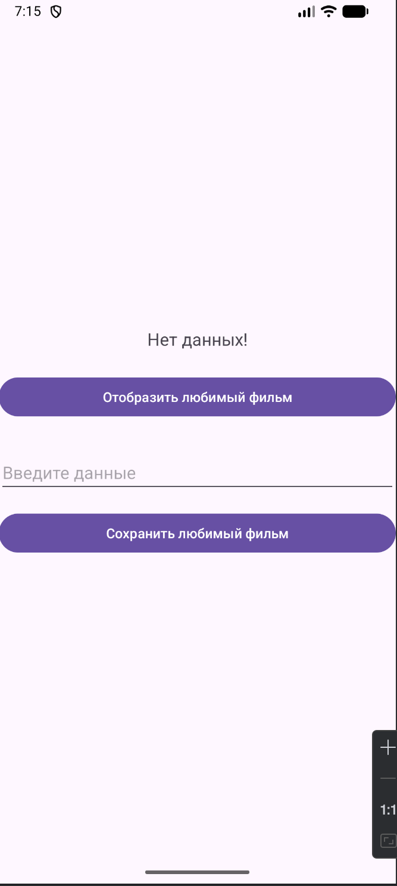
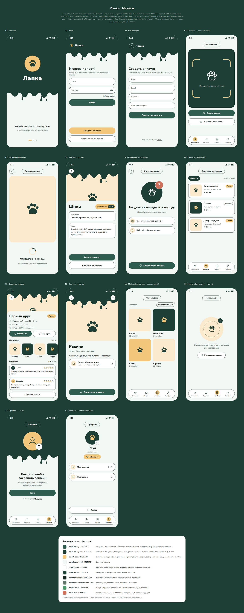
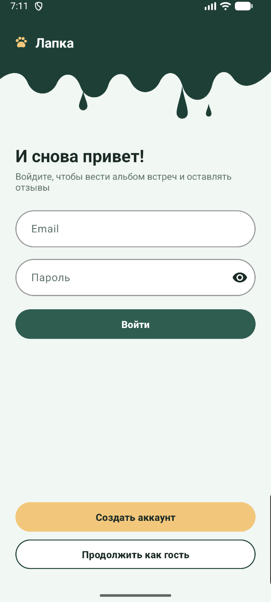
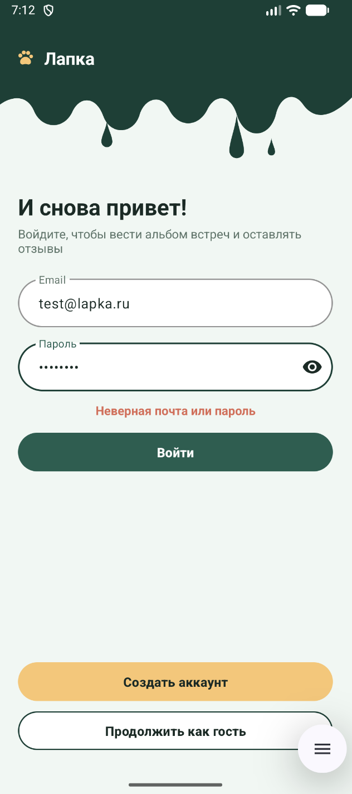
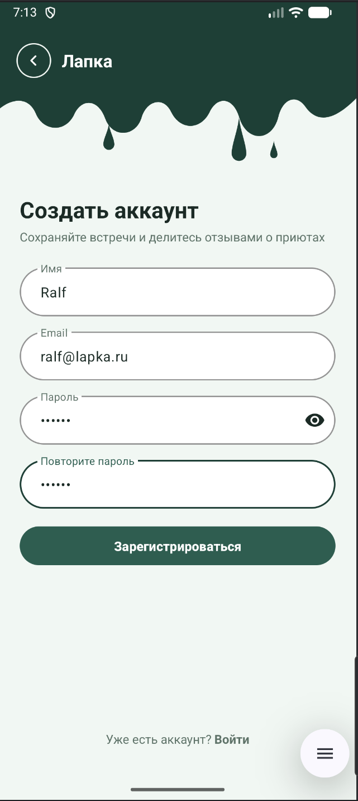

# Практическая работа № 2
### Модули, storage, Firebase Auth, три источника данных

Язык реализации — **Java**

| | |
|---|---|
| Студент | Иванов Раул Рашадович БСБО-09-23 |
| Пакет MovieProject | `ru.mirea.ivanovrr.lesson9` |
| Пакет своего приложения | `ru.mirea.ivanovrr.lapka` |

---

## Содержание

- [Что требовалось](#что-требовалось)
- [1. MovieProject: storage, модели, модули](#1-movieproject-storage-модели-модули)
- [2. Прототип Lapka](#2-прототип-lapka)
- [3. Модули Lapka](#3-модули-lapka)
- [4. Авторизация Firebase](#4-авторизация-firebase)
- [5. Три источника данных](#5-три-источника-данных)
- [Соответствие методичке](#соответствие-методичке)

---

## Что требовалось

| § | Задание | Где |
|---|---------|-----|
| Разбор | Убрать SharedPreferences из репозитория MovieProject в `MovieStorage` | [`MovieProject/data`](MovieProject/data) |
| Разбор | Своя модель в data и мапперы | `data/storage/models/Movie` |
| Разбор | Модули `app`, `data`, `domain` | [`MovieProject/settings.gradle.kts`](MovieProject/settings.gradle.kts) |
| Контрольное 1 | Прототип экранов | [Lapka — макеты (HTML)](LapkaDesign/lapka-ui-kit.html) |
| Контрольное 2 | Модули `data` и `domain` у своего приложения | [`Lapka/`](Lapka/) |
| Контрольное 3 | Activity авторизации, логика Firebase в трёх модулях | `AuthActivity` + `AuthRepositoryImpl` + `FirebaseAuthSource` |
| Контрольное 4 | SharedPreferences, Room, NetworkApi с моком | storage / room / network |

---

## 1. MovieProject: storage, модели, модули

Внешне приложение осталось тем же, что в практике 1. Поменялись структура сборки и класс, который обращается к SharedPreferences.

<p align="center">
  
</p>

<p align="center">
  <sub>Интерфейс прежний. Сохранённый фильм по-прежнему показывается кнопкой «Отобразить любимый фильм» и после перезапуска.</sub>
</p>

### Модули

```
MovieProject/
├── app/       presentation, layout
├── domain/    Java Library — без Android
└── data/      Android Library — storage + impl
```

```kotlin
rootProject.name = "MovieProject"
include(":app")
include(":data")
include(":domain")
```

`app` подключает `:domain` и `:data`, `data` — только `:domain`. В `domain` нет ни `Context`, ни SharedPreferences: это обычная Java-библиотека (`id("java-library")`).

```kotlin
dependencies {
    implementation(project(":domain"))
    implementation(project(":data"))

    implementation(libs.appcompat)
    implementation(libs.material)
    implementation(libs.activity)
    implementation(libs.constraintlayout)
}
```

### Storage

Репозиторий больше не работает с SharedPreferences напрямую. Появились интерфейс хранилища и его реализация:

```java
package ru.mirea.ivanovrr.lesson9.data.storage;

import ru.mirea.ivanovrr.lesson9.data.storage.models.Movie;

public interface MovieStorage {
    Movie get();
    boolean save(Movie movie);
}
```

Модель слоя data — **не** доменный `Movie`. В ней есть дополнительное поле с датой сохранения:

```java
package ru.mirea.ivanovrr.lesson9.data.storage.models;

public class Movie {
    private final int id;
    private final String name;
    private final String localDate;

    public Movie(int id, String name, String localDate) {
        this.id = id;
        this.name = name;
        this.localDate = localDate;
    }
    // геттеры
}
```

```java
package ru.mirea.ivanovrr.lesson9.data.storage.sharedprefs;

public class SharedPrefMovieStorage implements MovieStorage {
    private static final String SHARED_PREFS_NAME = "shared_prefs_name";
    private static final String KEY_NAME = "movie_name";
    private static final String KEY_DATE = "movie_date";
    private static final String KEY_ID = "movie_id";

    private final SharedPreferences sharedPreferences;

    public SharedPrefMovieStorage(Context context) {
        this.sharedPreferences = context.getApplicationContext()
                .getSharedPreferences(SHARED_PREFS_NAME, Context.MODE_PRIVATE);
    }

    @Override
    public Movie get() {
        String name = sharedPreferences.getString(KEY_NAME, null);
        if (name == null) {
            return null; // ещё ничего не сохраняли
        }
        String date = sharedPreferences.getString(KEY_DATE, "");
        int id = sharedPreferences.getInt(KEY_ID, -1);
        return new Movie(id, name, date);
    }

    @Override
    public boolean save(Movie movie) {
        return sharedPreferences.edit()
                .putString(KEY_NAME, movie.getName())
                .putString(KEY_DATE, movie.getLocalDate())
                .putInt(KEY_ID, movie.getId())
                .commit();
    }
}
```

### Мапперы в репозитории

```java
public class MovieRepositoryImpl implements MovieRepository {

    private final MovieStorage movieStorage;

    public MovieRepositoryImpl(MovieStorage movieStorage) {
        this.movieStorage = movieStorage;
    }

    @Override
    public boolean saveMovie(Movie movie) {
        return movieStorage.save(mapToStorage(movie));
    }

    @Override
    public Movie getMovie() {
        ru.mirea.ivanovrr.lesson9.data.storage.models.Movie movie = movieStorage.get();
        return movie == null ? null : mapToDomain(movie);
    }

    private ru.mirea.ivanovrr.lesson9.data.storage.models.Movie mapToStorage(Movie movie) {
        return new ru.mirea.ivanovrr.lesson9.data.storage.models.Movie(
                movie.getId(), movie.getName(), LocalDate.now().toString());
    }

    private Movie mapToDomain(ru.mirea.ivanovrr.lesson9.data.storage.models.Movie movie) {
        return new Movie(movie.getId(), movie.getName());
    }
}
```

Две модели называются одинаково, поэтому модель хранения записана полным именем, а доменная импортирована.

### Activity

По методичке: хранилище получает `this`, а репозиторий получает хранилище.

```java
MovieStorage sharedPrefMovieStorage = new SharedPrefMovieStorage(this);
MovieRepository movieRepository = new MovieRepositoryImpl(sharedPrefMovieStorage);
```

---

## 2. Прототип Lapka

HTML-макет (открывается в браузере):  
**[Lapka — макеты экранов Android](LapkaDesign/lapka-ui-kit.html)**

Файл: [`LapkaDesign/lapka-ui-kit.html`](LapkaDesign/lapka-ui-kit.html)

<p align="center">
  <a href="LapkaDesign/lapka-ui-kit.html">
    
  </a>
</p>

<p align="center">
  <sub>Экраны: заставка, вход, регистрация, распознавание (идёт / успех / порода не определена), приюты и магазины, страница приюта, карточка питомца, альбом встреч (полный / пустой), профиль (гость / пользователь). Внизу — роли цветов для colors.xml.</sub>
</p>

Палитра «Лесная мята»: фон `#F1F7F3`, primary `#2F5D50`, тёмный `#1E3F36`, акцент `#F3C77B`, текст `#1B2A25`, ошибка `#D0705B`. Экран входа в приложении сделан по этому макету: тёмная шапка с «чернильными» подтёками, логотип-лапка, поля и кнопки-пилюли. Цвета перенесены в `colors.xml` и тему `Theme.Lapka`.

---

## 3. Модули Lapka

```
Lapka/
├── app/       AuthActivity, MainActivity, di/ServiceLocator
├── domain/    модели, use case, интерфейсы репозиториев
└── data/      Firebase, SharedPreferences, Room, NetworkApi
```

```kotlin
rootProject.name = "Lapka"
include(":app")
include(":data")
include(":domain")
```

`domain` — Java Library без Android и Firebase. `data` — Android Library, в ней все зависимости хранения: Firebase BoM, `firebase-auth`, `room-runtime` и `room-compiler`. У `app` есть только плагин `google-services` и ссылки на два модуля. Классы Firebase и Room в `app` не импортируются.

---

## 4. Авторизация Firebase

Логика разделена на три модуля:

| Слой | Что |
|------|-----|
| domain | `AuthRepository`, `AuthResult`, `LoginUseCase`, `RegisterUseCase` — без Firebase SDK |
| data | `FirebaseAuthSource` (обёртка над `FirebaseAuth`) + `AuthRepositoryImpl` + `SharedPrefUserStorage` |
| app | `AuthActivity`, сборка зависимостей в `di/ServiceLocator` |

### Скриншоты

<p align="center">
  
  
  
</p>

<p align="center">
  <sub>Слева — вход. В центре — неверный пароль, сообщение выделено цветом ошибки. Справа — режим регистрации.</sub>
</p>

### Domain

```java
public interface AuthRepository {
    AuthResult login(String email, String password);
    AuthResult register(String email, String password, String name);
    User getCurrentUser();
    void logout();
}
```

`AuthResult` содержит либо пользователя, либо текст ошибки. Экрану не нужно знать, откуда пришла ошибка.

```java
public class LoginUseCase {
    static final int MIN_PASSWORD_LENGTH = 6;

    private final AuthRepository authRepository;

    public LoginUseCase(AuthRepository authRepository) {
        this.authRepository = authRepository;
    }

    public AuthResult execute(String email, String password) {
        if (email == null || !email.trim().contains("@")) {
            return AuthResult.failure("Введите корректную почту");
        }
        if (password == null || password.length() < MIN_PASSWORD_LENGTH) {
            return AuthResult.failure("Пароль — не короче " + MIN_PASSWORD_LENGTH + " символов");
        }
        return authRepository.login(email.trim(), password);
    }
}
```

### Data — Firebase + SharedPreferences клиента

Классы Firebase используются только в `FirebaseAuthSource`. `Task` из Firebase превращается в обычный блокирующий вызов через `Tasks.await`, а исключения — в понятные сообщения:

```java
public AuthUserDto signIn(String email, String password) throws AuthSourceException {
    AuthResult result = await(firebaseAuth.signInWithEmailAndPassword(email, password));
    return mapUser(result.getUser());
}

private String mapError(Throwable error) {
    if (error instanceof FirebaseAuthWeakPasswordException) return "Слишком простой пароль…";
    if (error instanceof FirebaseAuthUserCollisionException) return "Пользователь с такой почтой уже зарегистрирован";
    if (error instanceof FirebaseAuthInvalidCredentialsException) return "Неверная почта или пароль";
    if (error instanceof FirebaseNetworkException) return "Нет подключения к интернету";
    // …
}
```

Репозиторий выполняет вход через Firebase и сохраняет данные клиента в SharedPreferences:

```java
public class AuthRepositoryImpl implements AuthRepository {

    private final FirebaseAuthSource authSource;
    private final UserStorage userStorage;

    @Override
    public AuthResult login(String email, String password) {
        try {
            AuthUserDto user = authSource.signIn(email, password);
            UserStorageModel stored = mapToStorage(user);
            userStorage.save(stored);
            return AuthResult.success(mapToDomain(stored));
        } catch (AuthSourceException e) {
            return AuthResult.failure(e.getMessage());
        }
    }
    // register — createUserWithEmailAndPassword + имя в профиль Firebase,
    // logout — signOut + очистка SharedPreferences
}
```

Вход в Firebase — по **email**, пароль не короче 6 символов. Конфигурация: `Lapka/app/google-services.json`.

### Presentation

Стартовый экран — `AuthActivity`. Если Firebase помнит сессию, сразу открывается `MainActivity`. Вход и регистрация — два режима одного экрана, как на макетах 02 и 03. Запросы идут в фоновом потоке, результат возвращается через `runOnUiThread`:

```java
buttonLogin.setOnClickListener(v -> {
    String email = editTextEmail.getText().toString();
    String password = editTextPassword.getText().toString();
    setLoading(true);
    executor.execute(() -> {
        AuthResult result = loginUseCase.execute(email, password);
        runOnUiThread(() -> handleResult(result));
    });
});
```

Ошибка показывается под полями цветом `#D0705B` из палитры (`colorError`).

---

## 5. Три источника данных

| Источник | Класс | Что хранит |
|----------|--------|------------|
| SharedPreferences | `SharedPrefUserStorage` | uid, почта, имя клиента, время входа |
| Room | `LapkaDatabase`, `EncounterDao`, `ReviewDao`, `EncounterEntity`, `ReviewEntity` | альбом встреч и отзывы о приютах |
| NetworkApi | `NetworkApi` | породы, приюты и магазины, питомцы (мок JSON) |

Для каждого источника есть интерфейс хранилища (`UserStorage`, `EncounterStorage`, `ReviewStorage`) и своя модель. В репозиториях эти модели переводятся в доменные через `mapToStorage` и `mapToDomain`.

### SharedPreferences — клиент

```java
public class SharedPrefUserStorage implements UserStorage {
    private static final String PREFS_NAME = "lapka_user";

    private final SharedPreferences preferences;

    public SharedPrefUserStorage(Context context) {
        this.preferences = context.getApplicationContext()
                .getSharedPreferences(PREFS_NAME, Context.MODE_PRIVATE);
    }

    @Override
    public boolean save(UserStorageModel user) {
        return preferences.edit()
                .putString(KEY_UID, user.getUid())
                .putString(KEY_EMAIL, user.getEmail())
                .putString(KEY_NAME, user.getDisplayName())
                .putLong(KEY_LAST_LOGIN, user.getLastLoginMillis())
                .commit();
    }
}
```

### Room — альбом встреч и отзывы

```java
@Database(entities = {EncounterEntity.class, ReviewEntity.class}, version = 1, exportSchema = false)
public abstract class LapkaDatabase extends RoomDatabase {

    public abstract EncounterDao encounterDao();

    public abstract ReviewDao reviewDao();

    public static LapkaDatabase getInstance(Context context) {
        if (instance == null) {
            synchronized (LapkaDatabase.class) {
                if (instance == null) {
                    instance = Room.databaseBuilder(context.getApplicationContext(),
                            LapkaDatabase.class, "lapka.db").build();
                }
            }
        }
        return instance;
    }
}
```

```java
@Dao
public interface EncounterDao {
    @Insert(onConflict = OnConflictStrategy.REPLACE)
    long insert(EncounterEntity encounter);

    @Query("SELECT * FROM encounters ORDER BY created_at DESC")
    List<EncounterEntity> getAll();

    @Query("DELETE FROM encounters WHERE id = :id")
    int deleteById(String id);
}
```

`allowMainThreadQueries()` не используется: Room вызывается из фонового потока экрана. Activity не работает с Room напрямую — `RoomEncounterStorage` получает только `Context`.

### NetworkApi — мок

```java
public class NetworkApi {
    public List<BreedDto> getBreeds() throws NetworkException { … }
    public List<ShelterDto> getShelters() throws NetworkException { … }
    public List<PetDto> getPets() throws NetworkException { … }
}
```

`NetworkApi` возвращает JSON-строки, как настоящий сервер (`GET /breeds`, `/shelters`, `/pets`), с задержкой 400 мс, и разбирает их через `org.json` в DTO. В моке три породы (шпиц, лабрадор, мейн-кун), три места («Верный друг», «Лапки», «Добрые руки») и шесть питомцев. Репозиторий переводит DTO в доменные модели:

```java
public class ShelterRepositoryImpl implements ShelterRepository {

    private final NetworkApi networkApi;

    @Override
    public List<Shelter> getSheltersByBreed(String breedName) {
        List<Shelter> result = new ArrayList<>();
        for (ShelterDto dto : loadShelters()) {
            for (String breed : dto.breeds) {
                if (breed.equalsIgnoreCase(breedName)) {
                    result.add(mapToDomain(dto));
                    break;
                }
            }
        }
        return result;
    }
}
```

Все реализации создаёт `di/ServiceLocator`, а `MainActivity` получает из него только use case'ы. У каждой кнопки подписан источник данных:

```java
NetworkApi networkApi = new NetworkApi();

authRepository = new AuthRepositoryImpl(new FirebaseAuthSource(),
        new SharedPrefUserStorage(appContext));
breedRepository = new BreedRepositoryImpl(networkApi);
shelterRepository = new ShelterRepositoryImpl(networkApi);
petRepository = new PetRepositoryImpl(networkApi);
encounterRepository = new EncounterRepositoryImpl(new RoomEncounterStorage(appContext));
reviewRepository = new ReviewRepositoryImpl(new RoomReviewStorage(appContext));
```

---

## Соответствие методичке

| Требование | Как сделано |
|------------|-------------|
| Интерфейс хранилища и реализация в пакете storage | `MovieStorage` / `SharedPrefMovieStorage`; в Lapka — `UserStorage`, `EncounterStorage`, `ReviewStorage` |
| Отдельные модели хранения | `storage/models/Movie` с `localDate`; `UserStorageModel`, `EncounterEntity`, `ReviewEntity`; DTO для сети |
| Мапперы `mapToStorage` / `mapToDomain` в репозиториях | во всех репозиториях, где есть хранение |
| Модули перечислены в `settings.gradle.kts` | `include(":app")`, `include(":data")`, `include(":domain")` в обоих проектах |
| `domain` — Java Library, `data` — Android Library | `java-library` и `com.android.library` |
| Activity авторизации через Firebase | `AuthActivity` — стартовый экран, вход и регистрация по email |
| Firebase в трёх модулях | интерфейс и use case — domain, SDK — data, экран — app |
| SharedPreferences для данных клиента | `SharedPrefUserStorage` |
| Room | `LapkaDatabase` с двумя таблицами |
| `NetworkApi` с моком | `NetworkApi`, JSON → DTO → domain |
| Папка `di` в `app` | `ServiceLocator` |
