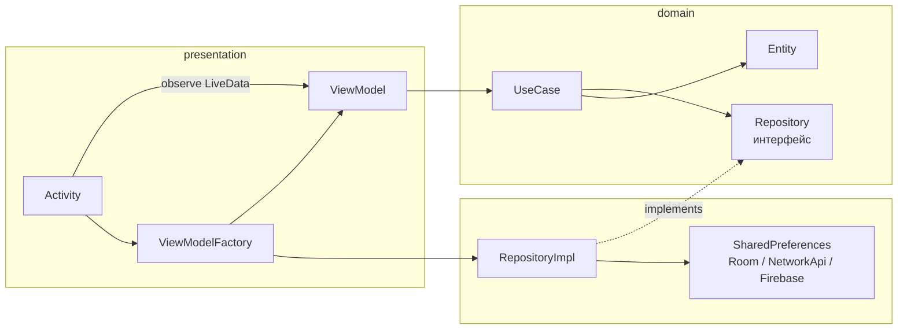
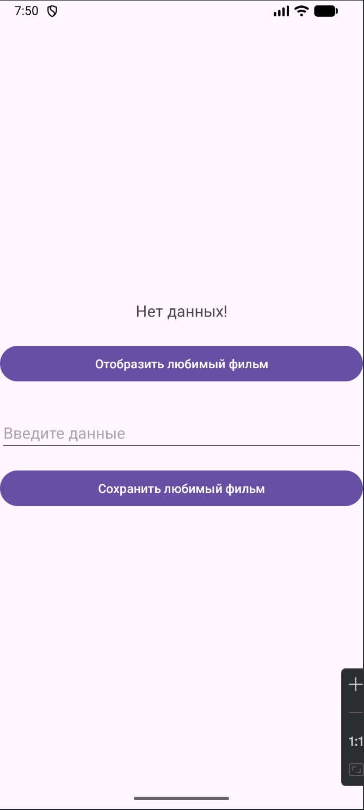
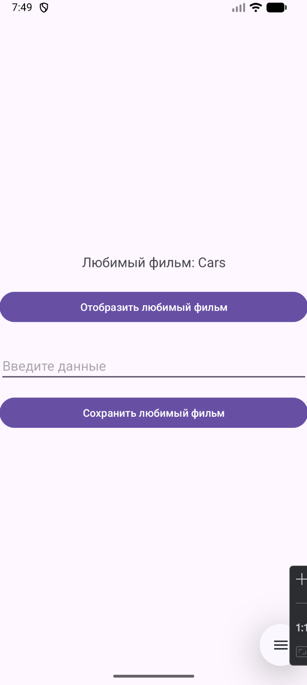
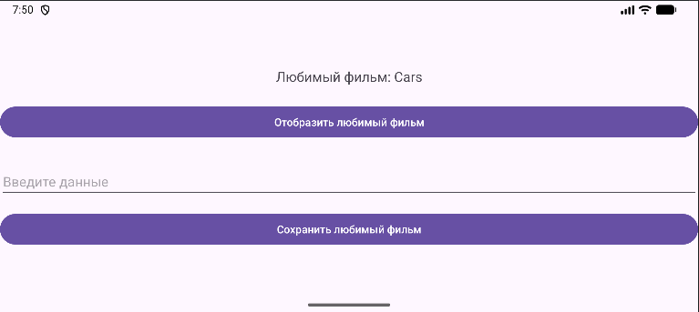
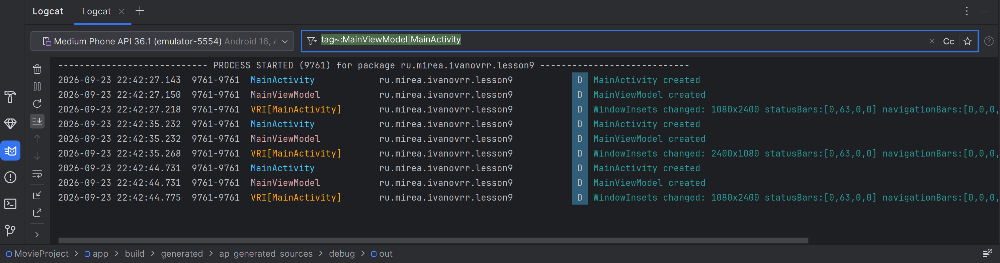
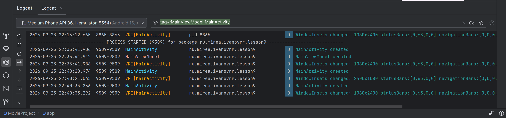
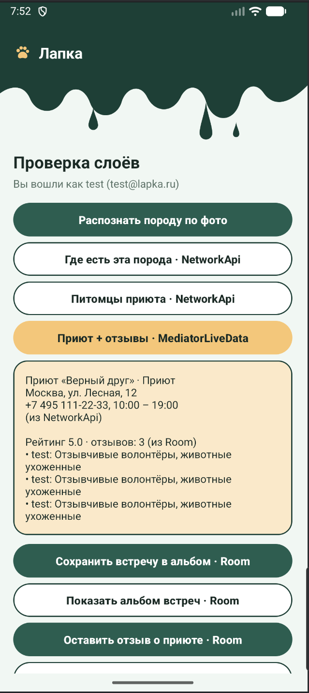
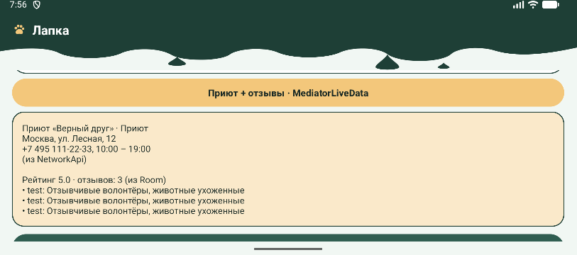

# Практическая работа № 3
### MVVM: ViewModel, LiveData, MediatorLiveData

Язык реализации — **Java**

| | |
|---|---|
| Студент | Иванов Раул Рашадович БСБО-09-23 |
| Пакет MovieProject | `ru.mirea.ivanovrr.lesson9` |
| Пакет своего приложения | `ru.mirea.ivanovrr.lapka` |

---

## Содержание

- [Что требовалось](#что-требовалось)
- [Слои после MVVM](#слои-после-mvvm)
- [1. MovieProject: ViewModel и LiveData](#1-movieproject-viewmodel-и-livedata)
- [2. Lapka: ViewModel на экранах](#2-lapka-viewmodel-на-экранах)
- [3. MediatorLiveData: сеть и БД](#3-mediatorlivedata-сеть-и-бд)
- [Соответствие методичке](#соответствие-методичке)

---

## Что требовалось

| § | Задание | Где |
|---|---------|-----|
| Разбор | Открыть приложение из практики 1, вынести логику из Activity в ViewModel | [`MovieProject/app/.../presentation`](MovieProject/app/src/main/java/ru/mirea/ivanovrr/lesson9/presentation) |
| Разбор | `ViewModelProvider` + `ViewModelFactory`, без `View`/`Context` во ViewModel | `MainViewModel`, `ViewModelFactory` |
| Разбор | Обновление UI через LiveData | `MutableLiveData<String> favoriteMovie` |
| Разбор | Что в logcat при повороте экрана | [раздел «Поворот экрана»](#поворот-экрана-и-logcat) |
| Контрольное 1 | Activity ходит в domain только через ViewModel | `AuthViewModel`, `MainViewModel` |
| Контрольное 2 | Состояние интерфейса через LiveData | observe в `AuthActivity` / `MainActivity` |
| Контрольное 3 | MediatorLiveData: мок-сеть + БД | `MainViewModel`: `shelterFromNetwork` + `reviewsFromDb` |

---

## Слои после MVVM

Зависимости только **внутрь**. Activity больше не вызывает use case и не создаёт репозитории. ViewModel не знает про Activity и не держит `View`/`Context`. Зависимости собирает `ViewModelFactory`.



| Слой | Содержимое | Зависимости |
|------|------------|-------------|
| `presentation` | Activity, ViewModel, Factory, layout | `domain`; Factory создаёт `*Impl` |
| `domain` | Entity, UseCase, интерфейс Repository | ни от кого |
| `data` | `RepositoryImpl`, storage, Room, мок API, Firebase | `domain` |

По сравнению с практикой 2 в слое `presentation` появился прямоугольник ViewModel: use case'ы теперь вызывает он, а Activity только слушает LiveData.

---

## 1. MovieProject: ViewModel и LiveData

Экран тот же. Меняется, **кто** вызывает use case и **как** текст попадает в `TextView`.

<p align="center">
  
  
</p>

<p align="center">
  <sub>Слева — старт, LiveData ещё пустая, в разметке «Нет данных!». Справа — после «Отобразить»: строка пришла из LiveData.</sub>
</p>

### Зависимости

```kotlin
// gradle/libs.versions.toml
lifecycle = "2.10.0"
lifecycle-viewmodel = { group = "androidx.lifecycle", name = "lifecycle-viewmodel", version.ref = "lifecycle" }
lifecycle-livedata  = { group = "androidx.lifecycle", name = "lifecycle-livedata",  version.ref = "lifecycle" }

// app/build.gradle.kts
implementation(libs.lifecycle.viewmodel)
implementation(libs.lifecycle.livedata)
```

### MainViewModel

Наследует `androidx.lifecycle.ViewModel`. Use case вызываются здесь. `setText` / `getText` ничего не возвращают — пишут в `MutableLiveData`.

```java
public class MainViewModel extends ViewModel {

    private static final String TAG = MainViewModel.class.getSimpleName();

    private final MovieRepository movieRepository;
    private final MutableLiveData<String> favoriteMovie = new MutableLiveData<>();

    public MainViewModel(MovieRepository movieRepository) {
        Log.d(TAG, "MainViewModel created");
        this.movieRepository = movieRepository;
    }

    public LiveData<String> getFavoriteMovie() {
        return favoriteMovie;
    }

    public void setText(Movie movie) {
        boolean result = new SaveMovieToFavoriteUseCase(movieRepository).execute(movie);
        favoriteMovie.setValue(String.format("Save result %s", result));
    }

    public void getText() {
        Movie movie = new GetFavoriteFilmUseCase(movieRepository).execute();
        if (movie == null) {
            favoriteMovie.setValue("Нет данных!");
        } else {
            favoriteMovie.setValue(String.format("Любимый фильм: %s", movie.getName()));
        }
    }

    @Override
    protected void onCleared() {
        Log.d(TAG, "MainViewModel cleared");
        super.onCleared();
    }
}
```

`SharedPrefMovieStorage` нужен `Context`. Во ViewModel его нет: репозиторий приходит через конструктор.

### ViewModelFactory

Как в методичке: фабрика знает `Context`, собирает storage и repository.

```java
public class ViewModelFactory implements ViewModelProvider.Factory {

    private final Context context;

    public ViewModelFactory(Context context) {
        this.context = context.getApplicationContext();
    }

    @NonNull
    @Override
    @SuppressWarnings("unchecked")
    public <T extends ViewModel> T create(@NonNull Class<T> modelClass) {
        if (modelClass.isAssignableFrom(MainViewModel.class)) {
            MovieStorage sharedPrefMovieStorage = new SharedPrefMovieStorage(context);
            MovieRepository movieRepository = new MovieRepositoryImpl(sharedPrefMovieStorage);
            return (T) new MainViewModel(movieRepository);
        }
        throw new IllegalArgumentException("Неизвестный класс ViewModel: " + modelClass.getName());
    }
}
```

### Activity

`AppCompatActivity` — это `ViewModelStoreOwner`. Не `new MainViewModel()`: тогда при повороте ViewModel тоже умрёт.

```java
vm = new ViewModelProvider(this, new ViewModelFactory(this)).get(MainViewModel.class);

vm.getFavoriteMovie().observe(this, text -> textViewMovie.setText(text));

findViewById(R.id.buttonSaveMovie).setOnClickListener(view ->
        vm.setText(new Movie(2, editTextMovie.getText().toString())));
findViewById(R.id.buttonGetMovie).setOnClickListener(view -> vm.getText());
```

Из `MainActivity` исчезли импорты use case'ов и `data`: остались только `R` и модель `Movie`.

### Поворот экрана и logcat

После «Отобразить» поворот не сбрасывает надпись: LiveData отдаёт последнее значение новой Activity.

<p align="center">
  
</p>

<p align="center">
  <sub>Альбомная ориентация: «Любимый фильм: Cars» на месте.</sub>
</p>

Ответ на вопрос методички «что отобразится в logcat при повороте экрана» проверен двумя запусками. В `MainActivity` для этого есть переключатель:

```java
private static final boolean CREATE_WITH_PROVIDER = true;
...
if (CREATE_WITH_PROVIDER) {
    vm = new ViewModelProvider(this, factory).get(MainViewModel.class);   // правильно
} else {
    vm = factory.create(MainViewModel.class);                             // то же, что new
}
```

Фильтр logcat: `tag~:MainViewModel|MainActivity`.

<p align="center">
  
</p>

<p align="center">
  <sub><code>CREATE_WITH_PROVIDER = false</code>: после каждого поворота вместе с «MainActivity created» появляется новый «MainViewModel created» — ViewModel живёт столько же, сколько Activity.</sub>
</p>

<p align="center">
  
</p>

<p align="center">
  <sub><code>CREATE_WITH_PROVIDER = true</code>: «MainViewModel created» один раз при запуске, дальше на каждый поворот только «MainActivity created». Строки <code>WindowInsets changed 1080x2400 / 2400x1080</code> — системный лог смены ориентации.</sub>
</p>

| Действие | `new MainViewModel(...)` | `ViewModelProvider` |
|----------|--------------------------|---------------------|
| Первый запуск | `MainActivity created`, `MainViewModel created` | `MainActivity created`, `MainViewModel created` |
| Поворот | `MainActivity created`, **`MainViewModel created`** | только `MainActivity created` |
| Закрыли приложение | — | `MainViewModel cleared` |

---

## 2. Lapka: ViewModel на экранах

Макеты те же, что на практике 2. Activity больше не создаёт репозитории и не вызывает use case: ни один класс `*Activity` не импортирует `domain.usecases`, `data` и `di`.

### AuthViewModel

Режим регистрации, загрузка, ошибка и «уже вошли» — LiveData. Firebase работает в фоновом потоке, поэтому результат публикуется через `postValue`.

```java
public class AuthViewModel extends ViewModel {

    private final LoginUseCase loginUseCase;
    private final RegisterUseCase registerUseCase;
    private final GetProfileUseCase getProfileUseCase;
    private final ExecutorService executor = Executors.newSingleThreadExecutor();

    private final MutableLiveData<Boolean> registerMode = new MutableLiveData<>(false);
    private final MutableLiveData<Boolean> loading = new MutableLiveData<>(false);
    private final MutableLiveData<String> error = new MutableLiveData<>();
    private final MutableLiveData<User> signedInUser = new MutableLiveData<>();

    public void login(String email, String password) {
        startLoading();
        executor.execute(() -> handleResult(loginUseCase.execute(email, password)));
    }

    public void register(String name, String email, String password, String passwordRepeat) {
        if (password == null || !password.equals(passwordRepeat)) {
            error.setValue("Пароли не совпадают");
            return;
        }
        startLoading();
        executor.execute(() -> handleResult(registerUseCase.execute(email, password, name)));
    }

    private void handleResult(AuthResult result) {
        loading.postValue(false);
        if (result.isSuccess()) {
            signedInUser.postValue(result.getUser());
        } else {
            error.postValue(result.getErrorMessage());
        }
    }
}
```

Если `GetProfileUseCase` уже видит пользователя (Firebase помнит сессию), `checkSession()` кладёт его в `signedInUser`, и Activity сразу открывает главный экран.

### AuthActivity

Только поля, кнопки и `observe`. Поворот в режиме регистрации оставляет поля «Имя» и «Повторите пароль»: `registerMode` живёт во ViewModel, а не в Activity.

```java
vm = new ViewModelProvider(this, new ViewModelFactory(this)).get(AuthViewModel.class);

vm.getRegisterMode().observe(this, this::showRegisterMode);
vm.getLoading().observe(this, this::showLoading);
vm.getError().observe(this, message -> {
    textViewStatus.setText(message);
    textViewStatus.setVisibility(TextUtils.isEmpty(message) ? View.GONE : View.VISIBLE);
});
vm.getSignedInUser().observe(this, user -> {
    if (user != null) openMain();
});

buttonLogin.setOnClickListener(v -> vm.login(
        editTextEmail.getText().toString(),
        editTextPassword.getText().toString()));
buttonCreateAccount.setOnClickListener(v -> vm.setRegisterMode(true));
```

<p align="center">
  
  
  
</p>

<p align="center">
  <sub>UI входа не менялся. Изменился слой — теперь между экраном и use case'ами стоит ViewModel. Ошибка по-прежнему цветом <code>#D0705B</code>.</sub>
</p>

### Фабрика Lapka

Один `ViewModelFactory` на оба экрана. Он берёт готовые use case'ы из `di/ServiceLocator`, поэтому `Context`, Firebase и Room остаются в `di` и `data`, а не во ViewModel.

```java
public <T extends ViewModel> T create(@NonNull Class<T> modelClass) {
    ServiceLocator sl = serviceLocator;
    if (modelClass.isAssignableFrom(AuthViewModel.class)) {
        return (T) new AuthViewModel(
                sl.provideLoginUseCase(),
                sl.provideRegisterUseCase(),
                sl.provideGetProfileUseCase());
    }
    if (modelClass.isAssignableFrom(MainViewModel.class)) {
        return (T) new MainViewModel(
                sl.provideGetProfileUseCase(),
                sl.provideLogoutUseCase(),
                sl.provideRecognizeBreedUseCase(),
                sl.provideGetBreedInfoUseCase(),
                sl.provideGetSheltersByBreedUseCase(),
                sl.provideGetShelterDetailsUseCase(),
                sl.provideGetPetsByShelterUseCase(),
                sl.provideSaveEncounterUseCase(),
                sl.provideGetEncountersUseCase(),
                sl.provideAddReviewUseCase(),
                sl.provideGetReviewsByShelterUseCase());
    }
    throw new IllegalArgumentException("Неизвестный класс ViewModel: " + modelClass.getName());
}
```

### MainViewModel главного экрана

Все кнопки главного экрана переехали во ViewModel. Результат любой кнопки уходит в `LiveData<String> log`, текущий пользователь — в `LiveData<User> currentUser`. Работа с данными идёт в фоне через общий метод:

```java
private void runInBackground(Supplier<String> task) {
    log.setValue("Загрузка…");
    executor.execute(() -> log.postValue(task.get()));
}

public void saveEncounter() {
    runInBackground(() -> {
        Encounter encounter = new Encounter(UUID.randomUUID().toString(), lastBreed,
                "file://photo.jpg", System.currentTimeMillis(), "встретил во дворе");
        if (!saveEncounterUseCase.execute(encounter)) {
            return "Гость не может сохранять встречи — сначала войдите";
        }
        return "Встреча сохранена в Room. Всего в альбоме: "
                + getEncountersUseCase.execute().size();
    });
}
```

`MainActivity` при этом стала совсем короткой: `observe` на четыре LiveData и по одному `setOnClickListener` на кнопку.

---

## 3. MediatorLiveData: сеть и БД

Контрольный пункт: свести замоканную сеть и Room. Во `MainViewModel` два источника и один результат:

| LiveData | Откуда | Что |
|----------|--------|-----|
| `shelterFromNetwork` | `NetworkApi` через `GetShelterDetailsUseCase` | приют «Верный друг»: адрес, телефон, часы |
| `reviewsFromDb` | Room через `GetReviewsByShelterUseCase` | отзывы об этом приюте |

`MediatorLiveData<String> shelterDetails` подписана на оба источника. Загрузки идут параллельно: отзывы из Room приходят почти сразу, приют из мок-сети — через 400 мс, и карточка пересобирается на каждый ответ.

```java
private final MutableLiveData<Shelter> shelterFromNetwork = new MutableLiveData<>();
private final MutableLiveData<List<Review>> reviewsFromDb = new MutableLiveData<>();
private final MediatorLiveData<String> shelterDetails = new MediatorLiveData<>();

// в конструкторе
shelterDetails.addSource(shelterFromNetwork, shelter -> combineShelterDetails());
shelterDetails.addSource(reviewsFromDb, reviews -> combineShelterDetails());

public void loadShelterDetails() {
    shelterFromNetwork.setValue(null);
    reviewsFromDb.setValue(null);
    executor.execute(() ->
            shelterFromNetwork.postValue(getShelterDetailsUseCase.execute(DEMO_SHELTER_ID)));
    executor.execute(() ->
            reviewsFromDb.postValue(getReviewsByShelterUseCase.execute(DEMO_SHELTER_ID)));
}

private void combineShelterDetails() {
    Shelter shelter = shelterFromNetwork.getValue();
    List<Review> reviews = reviewsFromDb.getValue();

    StringBuilder sb = new StringBuilder();
    if (shelter == null) {
        sb.append("Приют: загрузка из сети…");
    } else {
        sb.append(shelter.getName()).append(" · ").append(shelter.getType())
                .append("\n").append(shelter.getAddress())
                .append("\n").append(shelter.getPhone())
                .append(", ").append(shelter.getWorkingHours())
                .append("\n(из NetworkApi)");
    }
    sb.append("\n\n");
    if (reviews == null) {
        sb.append("Отзывы: загрузка из базы…");
    } else if (reviews.isEmpty()) {
        sb.append("Отзывов пока нет (из Room)");
    } else {
        // средний рейтинг + список отзывов
        sb.append(String.format(Locale.getDefault(), "Рейтинг %.1f · отзывов: %d (из Room)",
                sum / reviews.size(), reviews.size()));
        ...
    }
    shelterDetails.setValue(sb.toString());
}
```

Когда пользователь оставляет новый отзыв, `addReview()` обновляет источник `reviewsFromDb`, и Mediator сам пересобирает карточку — Activity об этом ничего не знает.

`MainActivity` только подписывается:

```java
vm.getShelterDetails().observe(this, textViewShelter::setText);
findViewById(R.id.buttonShelterDetails).setOnClickListener(v -> vm.loadShelterDetails());
```

<p align="center">
  
  
</p>

<p align="center">
  <sub>Слева — после кнопки «Приют + отзывы · MediatorLiveData»: адрес и телефон из мок-сети, рейтинг 5.0 и три отзыва из Room. Справа — поворот, карточка на месте. Для альбомной ориентации добавлена своя разметка шапки <code>layout-land/view_ink_header.xml</code>.</sub>
</p>

---

## Соответствие методичке

| Требование | Как сделано |
|------------|-------------|
| Класс, наследуемый от `ViewModel`, с логами в конструкторе и `onCleared()` | `MainViewModel` в MovieProject; `AuthViewModel`, `MainViewModel` в Lapka |
| Правильное создание через `ViewModelProvider` | `new ViewModelProvider(this, factory).get(...)` во всех Activity |
| Ответ, что в logcat при повороте | два скриншота logcat: через `new` и через Provider |
| Логика use case'ов перенесена во ViewModel, репозиторий — через конструктор | ViewModel не импортируют Android UI и `Context` |
| `ViewModelFactory` с переопределённым `create` | по одной фабрике на проект |
| `MutableLiveData` + `observe` в Activity | `favoriteMovie`; `log`, `currentUser`, `registerMode`, `loading`, `error` |
| Контрольное 1: Activity → domain только через ViewModel | в `*Activity` нет импортов `usecases`, `data`, `di` |
| Контрольное 2: состояние UI через LiveData | все `TextView`, видимость и кнопки обновляются из `observe` |
| Контрольное 3: `MediatorLiveData` из мок-сети и БД | `shelterDetails` = `shelterFromNetwork` (NetworkApi) + `reviewsFromDb` (Room) |
