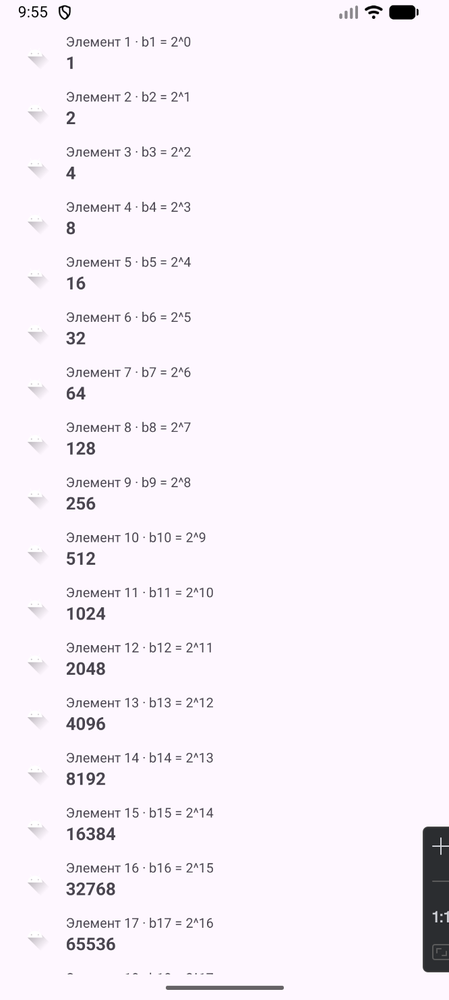
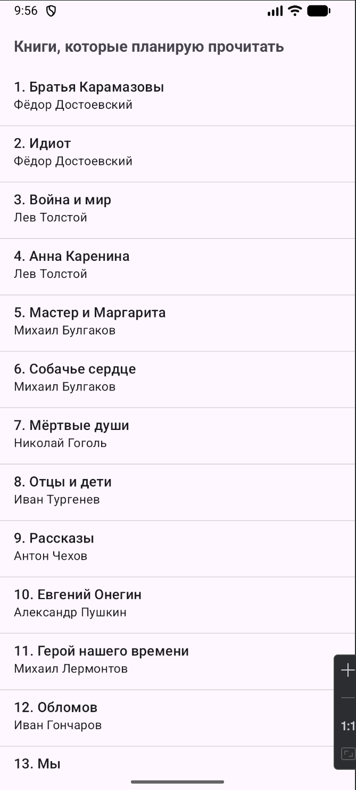
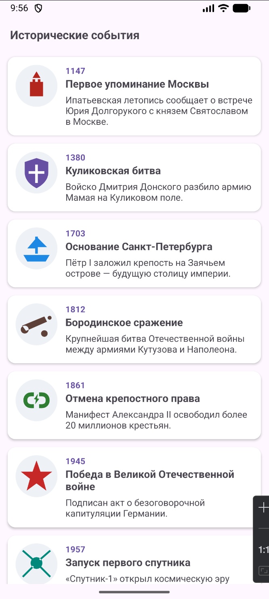
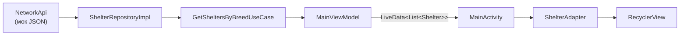
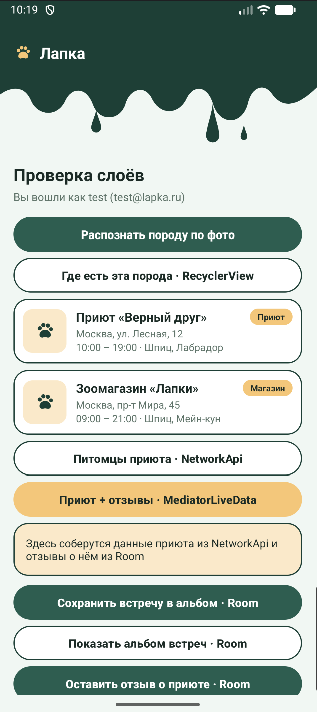

# Практическая работа № 4
### Списки: ScrollView, ListView, RecyclerView

Язык реализации — **Java**

| | |
|---|---|
| Студент | Иванов Раул Рашадович БСБО-09-23 |
| Учебные модули | [`MovieProject/`](MovieProject/) |
| Пакет своего приложения | `ru.mirea.ivanovrr.lapka` |

---

## Содержание

- [Что требовалось](#что-требовалось)
- [1. ScrollViewApp](#1-scrollviewapp)
- [2. ListViewApp](#2-listviewapp)
- [3. RecyclerViewApp](#3-recyclerviewapp)
- [4. Lapka: приюты в RecyclerView](#4-lapka-приюты-в-recyclerview)
- [Соответствие методичке](#соответствие-методичке)

---

## Что требовалось

| § | Задание | Где |
|---|---------|-----|
| 1.1 | Модуль `ScrollViewApp`: геометрическая прогрессия со знаменателем 2, 100 элементов, скрин | [`MovieProject/scrollviewapp`](MovieProject/scrollviewapp) |
| 1.2 | Модуль `ListViewApp`: авторы и книги на 30 лет, больше 30 пунктов, скрин | [`MovieProject/listviewapp`](MovieProject/listviewapp) |
| 1.3 | Список исторических событий с описанием и картинкой, скрин | [`MovieProject/recyclerviewapp`](MovieProject/recyclerviewapp) |
| Контрольное | Своё приложение: заглушка в репозитории → LiveData → RecyclerView | [`Lapka/`](Lapka/) |

Три учебных приложения добавлены модулями в проект `MovieProject` через **File → New → New Module → Phone & Tablet → Empty Views Activity**:

```
MovieProject/
├── app/ data/ domain/    — MovieProject с практик 1–3
├── scrollviewapp/        application
├── listviewapp/          application
└── recyclerviewapp/      application
```

```kotlin
rootProject.name = "MovieProject"
include(":app")
include(":data")
include(":domain")
include(":scrollviewapp")
include(":listviewapp")
include(":recyclerviewapp")
```

---

## 1. ScrollViewApp

Пакет `ru.mirea.ivanovrr.scrollviewapp`. Разметка элемента `item.xml`: иконка, подпись с номером члена и само число. На экране `ScrollView` → `LinearLayout` (`wrapper`). 100 строк добавляются через `LayoutInflater`.

Первый член 1, знаменатель 2: 1, 2, 4, …, 2⁹⁹. Последние члены больше `long`, поэтому счёт через `BigInteger`.

```java
LinearLayout wrapper = findViewById(R.id.wrapper);
BigInteger value = BigInteger.ONE; // b1 = 1
for (int i = 0; i < COUNT; i++) {
    View view = getLayoutInflater().inflate(R.layout.item, wrapper, false);
    TextView index = view.findViewById(R.id.textViewIndex);
    TextView text = view.findViewById(R.id.textView);
    index.setText(String.format(Locale.getDefault(), "Элемент %d · b%d = 2^%d", i + 1, i + 1, i));
    text.setText(value.toString());
    wrapper.addView(view);
    value = value.multiply(BigInteger.valueOf(RATIO)); // b(n+1) = bn * 2
}
```

<p align="center">
  
</p>

<p align="center">
  <sub>Список длиннее экрана, прокручивается. На скрине начало: 1…65536.</sub>
</p>

---

## 2. ListViewApp

Пакет `ru.mirea.ivanovrr.listviewapp`. `ListView` + `ArrayAdapter` с переопределённым `getView`, как в разборе методички. **35** книг: модель `Book` (автор, название), разметка системная `simple_list_item_2`.

```java
ArrayAdapter<Book> adapter = new ArrayAdapter<Book>(this,
        android.R.layout.simple_list_item_2, android.R.id.text1, books) {
    @Override
    public View getView(int position, View convertView, ViewGroup parent) {
        View view = super.getView(position, convertView, parent);
        TextView text1 = view.findViewById(android.R.id.text1);
        TextView text2 = view.findViewById(android.R.id.text2);

        Book book = getItem(position);
        text1.setText(String.format(Locale.getDefault(), "%d. %s",
                position + 1, book == null ? "" : book.getTitle()));
        text2.setText(book == null ? "" : book.getAuthor());
        return view;
    }
};
booksList.setAdapter(adapter);
```

`super.getView` переиспользует `convertView`, поэтому строки не создаются заново при каждом скролле. По нажатию на пункт показывается `Toast` с автором и названием.

<p align="center">
  
</p>

<p align="center">
  <sub>Две строки в пункте: номер и книга жирным, автор серым. 35 записей.</sub>
</p>

---

## 3. RecyclerViewApp

Пакет `ru.mirea.ivanovrr.recyclerviewapp`. **10** событий (от первого упоминания Москвы до появления Всемирной паутины): векторная эмблема, год, название, краткое описание. Карточка — `CardView` + `ConstraintLayout`.

Как в разборе методички: модель `HistoricalEvent` → `EventViewHolder` → `EventRecyclerViewAdapter` → `LinearLayoutManager`. Картинка ищется по имени ресурса через `getIdentifier`, как флаги в примере.

```java
public class EventRecyclerViewAdapter extends RecyclerView.Adapter<EventViewHolder> {

    private final List<HistoricalEvent> events;
    private Context context;

    @NonNull
    @Override
    public EventViewHolder onCreateViewHolder(@NonNull ViewGroup parent, int viewType) {
        context = parent.getContext();
        View itemView = LayoutInflater.from(context)
                .inflate(R.layout.event_item_view, parent, false);
        return new EventViewHolder(itemView);
    }

    @Override
    public void onBindViewHolder(@NonNull EventViewHolder holder, int position) {
        HistoricalEvent event = events.get(position);
        int resId = context.getResources().getIdentifier(
                event.getImageName(), "drawable", context.getPackageName());
        holder.getImageView().setImageResource(resId);
        holder.getYearView().setText(String.valueOf(event.getYear()));
        holder.getTitleView().setText(event.getTitle());
        holder.getDescriptionView().setText(event.getDescription());
        holder.itemView.setOnClickListener(v ->
                Toast.makeText(context, event.toString(), Toast.LENGTH_SHORT).show());
    }

    @Override
    public int getItemCount() {
        return events.size();
    }
}
```

В Activity:

```java
recyclerView.setAdapter(new EventRecyclerViewAdapter(getListData()));
recyclerView.setLayoutManager(
        new LinearLayoutManager(this, LinearLayoutManager.VERTICAL, false));
```

Зависимости: `androidx.recyclerview:recyclerview:1.4.0`, `androidx.cardview:cardview:1.0.0`.

<p align="center">
  
</p>

<p align="center">
  <sub>Карточка: эмблема + год и название + описание. По нажатию — Toast.</sub>
</p>

---

## 4. Lapka: приюты в RecyclerView

Контрольное: заглушка в репозитории, LiveData, список на экране.



Заглушка — `NetworkApi` из практики 2: три места («Верный друг», «Лапки», «Добрые руки») с типом, адресом, телефоном, часами и списком пород. `ShelterRepositoryImpl` мапит DTO в domain. `ViewModelFactory` собирает зависимости через `ServiceLocator`, во ViewModel `Context` нет.

Во `MainViewModel` кнопка «Где есть эта порода» теперь кладёт результат не в текст, а в `LiveData` со списком:

```java
private final MutableLiveData<List<Shelter>> shelters = new MutableLiveData<>();

public LiveData<List<Shelter>> getShelters() { return shelters; }

public void loadShelters() {
    runInBackground(() -> {
        List<Shelter> found = getSheltersByBreedUseCase.execute(lastBreed);
        shelters.postValue(found);
        return found.isEmpty()
                ? "Ничего не найдено"
                : "Где есть порода " + lastBreed + ": " + found.size() + " мест — список ниже";
    });
}
```

Адаптер с `ViewHolder` и методом `setItems`, как в примере методички:

```java
public class ShelterAdapter extends RecyclerView.Adapter<ShelterAdapter.ShelterViewHolder> {

    private List<Shelter> items = new ArrayList<>();

    public void setItems(List<Shelter> shelters) {
        this.items = shelters == null ? new ArrayList<>() : shelters;
        notifyDataSetChanged();
    }

    @Override
    public void onBindViewHolder(@NonNull ShelterViewHolder holder, int position) {
        holder.bind(items.get(position));
    }

    static class ShelterViewHolder extends RecyclerView.ViewHolder {
        void bind(Shelter shelter) {
            name.setText(shelter.getName());
            type.setText(shelter.getType());
            address.setText(shelter.getAddress());
            hours.setText(shelter.getWorkingHours() + " · "
                    + String.join(", ", shelter.getAvailableBreeds()));
        }
    }
}
```

Activity только подписывается:

```java
ShelterAdapter shelterAdapter = new ShelterAdapter();
RecyclerView recyclerShelters = findViewById(R.id.recyclerShelters);
recyclerShelters.setLayoutManager(new LinearLayoutManager(this));
recyclerShelters.setAdapter(shelterAdapter);

vm.getShelters().observe(this, shelterAdapter::setItems);
findViewById(R.id.buttonShelters).setOnClickListener(v -> vm.loadShelters());
```

Карточка `item_shelter.xml` сделана по экрану 08 «Приюты и магазины» из [макета](LapkaDesign/lapka-ui-kit.html): заглушка фото на пшеничной подложке, название, чип «Приют» / «Магазин», адрес, часы и породы. Список лежит внутри `ScrollView` главного экрана, поэтому у `RecyclerView` выключен `nestedScrollingEnabled`.

Авторизация и остальные кнопки с практики 3 не менялись. Полноценные экраны по макету (карточка породы, страница приюта, альбом, профиль) будут собраны на фрагментах в практиках 6–7.

<p align="center">
  
</p>

<p align="center">
  <sub>После кнопки «Где есть эта порода» — карточки приютов с породой «Шпиц». Данные из мока через LiveData.</sub>
</p>

---

## Соответствие методичке

| Требование | Как сделано |
|------------|-------------|
| Модуль `ScrollViewApp`, прогрессия со знаменателем 2 до 100 элементов | `scrollviewapp`: `LayoutInflater` + `LinearLayout` внутри `ScrollView`, `BigInteger` |
| Модуль `ListViewApp`, авторы и книги, больше 30 | `listviewapp`: 35 книг, `ArrayAdapter` с `getView`, `simple_list_item_2` |
| Модуль с `RecyclerView`: исторические события с описанием и картинкой | `recyclerviewapp`: `CardView`, `ViewHolder`, `Adapter` с тремя обязательными методами, `LinearLayoutManager` |
| Скрины трёх модулей приложены | `docs/practice4/*.png` |
| Контрольное: заглушка данных в репозитории | `NetworkApi` → `ShelterRepositoryImpl` |
| Контрольное: данные в представление через LiveData | `MainViewModel.getShelters()` |
| Контрольное: установить в `RecyclerView` | `ShelterAdapter` + `item_shelter.xml` |
