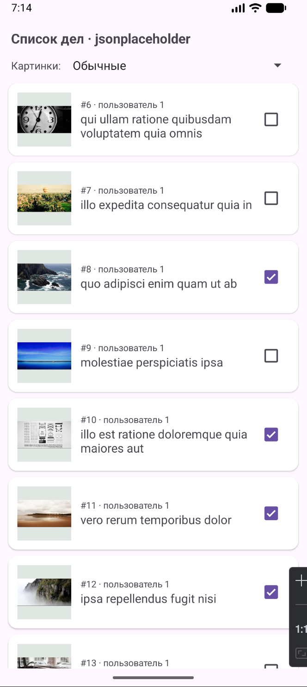
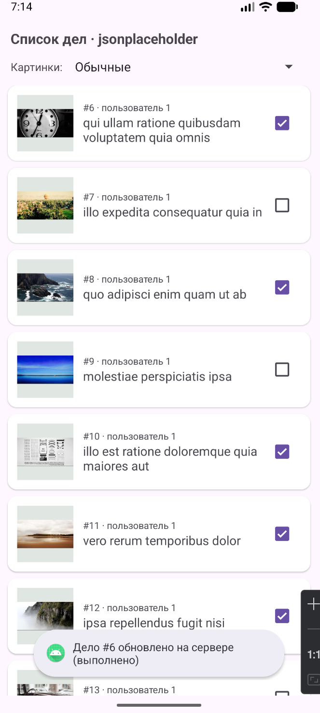
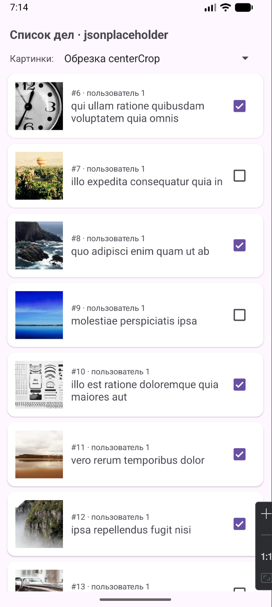
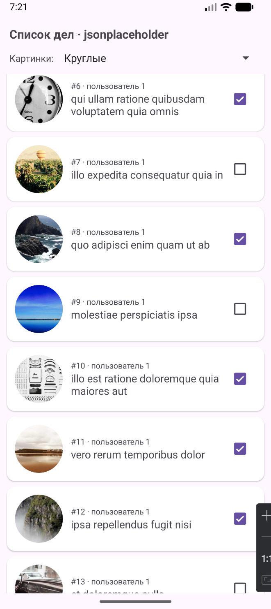
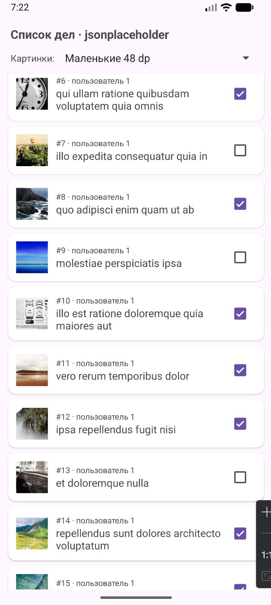
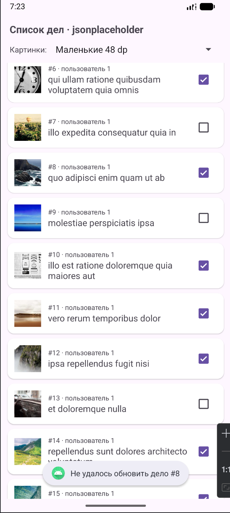
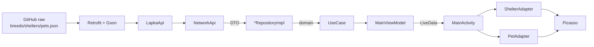
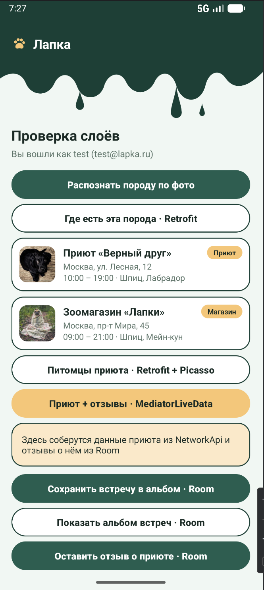
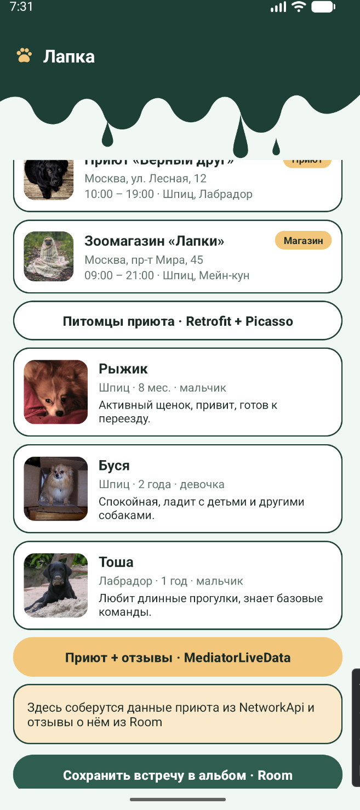
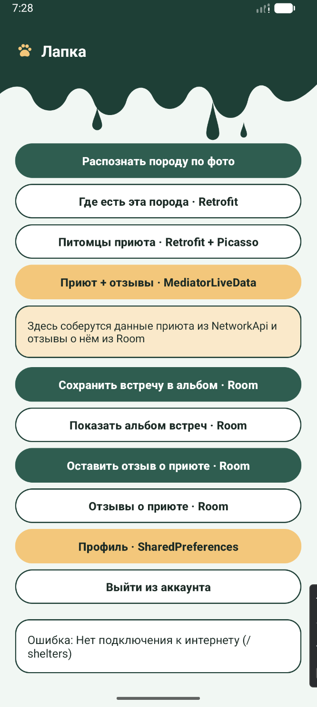

# Практическая работа № 5
### Retrofit + Picasso

Язык реализации — **Java**

| | |
|---|---|
| Студент | Иванов Раул Рашадович БСБО-09-23 |
| Учебный модуль | [`MovieProject/retrofitapp`](MovieProject/retrofitapp) · `ru.mirea.ivanovrr.retrofitapp` |
| Пакет своего приложения | `ru.mirea.ivanovrr.lapka` |

---

## Содержание

- [Что требовалось](#что-требовалось)
- [1. RetrofitApp: список дел](#1-retrofitapp-список-дел)
- [2. PUT при смене CheckBox](#2-put-при-смене-checkbox)
- [3. Picasso: режимы отображения](#3-picasso-режимы-отображения)
- [4. Ошибки сети и Retry](#4-ошибки-сети-и-retry)
- [5. Lapka: Retrofit и Picasso](#5-lapka-retrofit-и-picasso)
- [Соответствие методичке](#соответствие-методичке)

---

## Что требовалось

| § | Задание | Где |
|---|---------|-----|
| 1 | Модуль `RetrofitApp`: GET todos с JSONPlaceholder, POJO, интерфейс, RecyclerView | [`MovieProject/retrofitapp`](MovieProject/retrofitapp) |
| 1 (доп.) | PUT `/todos/{id}` при обновлении состояния CheckBox | `ApiService.updateTodo`, `MainActivity.updateTodo` |
| 2 | Picasso: картинки в пункте списка, настройка параметров отображения | `TodoAdapter`, Spinner режимов, `CircleTransformation` |
| Контрольное | Своё приложение: сущности из сети через Retrofit, ошибки, картинки Picasso | [`Lapka/`](Lapka/) · `NetworkApi`, `LapkaApi`, адаптеры |

Учебный модуль добавлен в `MovieProject` через **File → New → New Module → Phone & Tablet → Empty Views Activity**:

```
MovieProject/
├── app/ data/ domain/          — MovieProject с практик 1–3
├── scrollviewapp/
├── listviewapp/
├── recyclerviewapp/            — практика 4
└── retrofitapp/                — практика 5
```

```kotlin
rootProject.name = "MovieProject"
include(":app")
include(":data")
include(":domain")
include(":scrollviewapp")
include(":listviewapp")
include(":recyclerviewapp")
include(":retrofitapp")
```

Зависимости учебного модуля (`retrofitapp/build.gradle.kts` и каталог версий):

```kotlin
// gradle/libs.versions.toml
retrofit = "2.11.0"
picasso = "2.8"

// retrofitapp/build.gradle.kts
implementation(libs.retrofit)
implementation(libs.retrofit.converter.gson)
implementation(libs.picasso)
implementation(libs.recyclerview)
implementation(libs.cardview)
```

В манифесте модуля — `android.permission.INTERNET` (и Retrofit, и Picasso ходят в сеть).

---

## 1. RetrofitApp: список дел

Пакет `ru.mirea.ivanovrr.retrofitapp`. Сервер — [JSONPlaceholder](https://jsonplaceholder.typicode.com/), сущность Todo.

```
retrofitapp/src/main/java/ru/mirea/ivanovrr/retrofitapp/
├── Todo.java
├── ApiService.java
├── MainActivity.java
├── TodoAdapter.java
├── TodoViewHolder.java
└── CircleTransformation.java
```

### Скриншоты

<p align="center">
  
  
</p>

<p align="center">
  <sub>Слева — GET /todos: карточки с картинкой picsum, номером, заголовком и CheckBox. Справа — после смены чекбокса Toast об обновлении дела на сервере.</sub>
</p>

### POJO

Поля совпадают с JSON; Gson заполняет их по `@SerializedName`. URL картинки детерминирован по `id`, чтобы Picasso кэшировал её между запусками.

```java
public class Todo {

    @SerializedName("userId")
    @Expose
    private Integer userId;

    @SerializedName("id")
    @Expose
    private Integer id;

    @SerializedName("title")
    @Expose
    private String title;

    @SerializedName("completed")
    @Expose
    private Boolean completed;

    // геттеры / setCompleted

    /** Картинка для дела: детерминированная по id. */
    public String getImageUrl() {
        return "https://picsum.photos/seed/todo" + id + "/300/300";
    }
}
```

### ApiService

```java
public interface ApiService {

    @GET("todos")
    Call<List<Todo>> getTodos();

    /** PUT /todos/{id} с телом в JSON. jsonplaceholder возвращает обновлённый объект. */
    @PUT("todos/{id}")
    Call<Todo> updateTodo(@Path("id") int id, @Body Todo todo);
}
```

### MainActivity — конфигурация и GET

```java
public static final String BASE_URL = "https://jsonplaceholder.typicode.com/";

Retrofit retrofit = new Retrofit.Builder()
        .baseUrl(BASE_URL)
        .addConverterFactory(GsonConverterFactory.create())
        .build();
apiService = retrofit.create(ApiService.class);

apiService.getTodos().enqueue(new Callback<List<Todo>>() {
    @Override
    public void onResponse(@NonNull Call<List<Todo>> call,
                           @NonNull Response<List<Todo>> response) {
        if (response.isSuccessful() && response.body() != null) {
            todoAdapter = new TodoAdapter(MainActivity.this, response.body(),
                    MainActivity.this::updateTodo);
            todoAdapter.setImageMode(spinnerMode.getSelectedItemPosition());
            recyclerView.setAdapter(todoAdapter);
            showList();
        } else {
            // сервер ответил, но не 2xx — например 404 или 500
            showError(getString(R.string.error_http, response.code()));
        }
    }

    @Override
    public void onFailure(@NonNull Call<List<Todo>> call, @NonNull Throwable t) {
        // нет сети, неверный адрес, не разобрался JSON
        showError(getString(R.string.error_network, t.getMessage()));
    }
});
```

Запрос асинхронный (`enqueue`): сеть в фоне, `Callback` — в main-потоке. HTTP-коды 4xx/5xx приходят в `onResponse`, а не в `onFailure` — проверяется `response.isSuccessful()`.

Пункт списка — `CardView` (`item.xml`): `ImageView`, `#id · пользователь N`, title, CheckBox.

---

## 2. PUT при смене CheckBox

Задание методички: при обновлении состояния CheckBox отправить PUT. Слушатель живёт в адаптере, сам запрос — в Activity.

```java
// TodoAdapter.onBindViewHolder
holder.checkBoxCompleted.setOnCheckedChangeListener(null);
holder.checkBoxCompleted.setChecked(todo.getCompleted());
holder.checkBoxCompleted.setOnCheckedChangeListener((buttonView, isChecked) -> {
    if (buttonView.isPressed()) {
        // только жест пользователя, не переиспользование ViewHolder
        listener.onCompletedChanged(todo, isChecked);
    }
});
```

```java
private void updateTodo(Todo todo, boolean completed) {
    todo.setCompleted(completed);
    apiService.updateTodo(todo.getId(), todo).enqueue(new Callback<Todo>() {
        @Override
        public void onResponse(@NonNull Call<Todo> call, @NonNull Response<Todo> response) {
            if (response.isSuccessful() && response.body() != null) {
                String state = getString(response.body().getCompleted()
                        ? R.string.done : R.string.not_done);
                Toast.makeText(MainActivity.this,
                        getString(R.string.todo_updated, todo.getId(), state),
                        Toast.LENGTH_SHORT).show();
            } else {
                Toast.makeText(MainActivity.this,
                        getString(R.string.todo_update_failed, todo.getId()),
                        Toast.LENGTH_SHORT).show();
            }
        }

        @Override
        public void onFailure(@NonNull Call<Todo> call, @NonNull Throwable t) {
            // откатываем чекбокс, раз сервер не подтвердил
            todo.setCompleted(!completed);
            todoAdapter.notifyDataSetChanged();
            Toast.makeText(MainActivity.this,
                    getString(R.string.todo_update_failed, todo.getId()),
                    Toast.LENGTH_SHORT).show();
        }
    });
}
```

JSONPlaceholder принимает PUT и возвращает обновлённый объект (на сервере реально не сохраняет — для учебной демонстрации достаточно).

---

## 3. Picasso: режимы отображения

В шапке экрана Spinner (`spinnerMode`) с четырьмя режимами из `R.array.image_modes`: «Обычные», «Обрезка centerCrop», «Круглые», «Маленькие 48 dp». Смена пункта вызывает `todoAdapter.setImageMode(position)` → `notifyDataSetChanged()`.

<p align="center">
  
  
  
</p>

<p align="center">
  <sub>Один и тот же URL picsum, разные параметры Picasso. Placeholder — пока грузится, error — если не загрузилось.</sub>
</p>

```java
private void loadImage(TodoViewHolder holder, Todo todo) {
    RequestCreator request = Picasso.get()
            .load(todo.getImageUrl())
            .placeholder(R.drawable.ic_launcher_background)
            .error(android.R.drawable.ic_dialog_alert);

    switch (imageMode) {
        case MODE_CENTER_CROP:
            request.fit().centerCrop();
            break;
        case MODE_CIRCLE:
            request.fit().centerCrop().transform(new CircleTransformation());
            break;
        case MODE_SMALL:
            request.resize(48, 48).centerInside();
            break;
        default: // MODE_DEFAULT
            request.fit().centerInside();
    }
    request.into(holder.imageView);
}
```

`CircleTransformation` реализует `com.squareup.picasso.Transformation`: квадрат из центра и круг через `BitmapShader`. Ключ кэша — `"circle"`.

| Режим Spinner | Константа | Что делает Picasso |
|---------------|-----------|--------------------|
| Обычные | `MODE_DEFAULT` | `fit().centerInside()` |
| Обрезка centerCrop | `MODE_CENTER_CROP` | `fit().centerCrop()` |
| Круглые | `MODE_CIRCLE` | `fit().centerCrop().transform(CircleTransformation)` |
| Маленькие 48 dp | `MODE_SMALL` | `resize(48, 48).centerInside()` |

---

## 4. Ошибки сети и Retry

Три состояния экрана: загрузка (`ProgressBar`), список, блок ошибки (`layoutError`) с текстом и кнопкой «Повторить» (`buttonRetry`).

<p align="center">
  
</p>

<p align="center">
  <sub>Airplane mode или неверный BASE_URL → onFailure → layoutError. «Повторить» снова вызывает loadTodos().</sub>
</p>

```java
private void showLoading() {
    progressBar.setVisibility(View.VISIBLE);
    layoutError.setVisibility(View.GONE);
    recyclerView.setVisibility(View.GONE);
}

private void showList() {
    progressBar.setVisibility(View.GONE);
    layoutError.setVisibility(View.GONE);
    recyclerView.setVisibility(View.VISIBLE);
}

private void showError(String message) {
    progressBar.setVisibility(View.GONE);
    recyclerView.setVisibility(View.GONE);
    textViewError.setText(message);
    layoutError.setVisibility(View.VISIBLE);
}
```

| Ситуация | Куда попадает | Что видит пользователь |
|----------|---------------|------------------------|
| Нет сети / DNS / таймаут | `onFailure` | «Нет соединения с сервером: …» + Retry |
| HTTP 4xx/5xx | `onResponse`, `!isSuccessful()` | «Сервер ответил ошибкой N» + Retry |
| PUT не прошёл | `onFailure` у `updateTodo` | Toast + откат CheckBox |

---

## 5. Lapka: Retrofit и Picasso

Контрольное: открыть приложение с практики 1, получать сущности из сети через Retrofit, обработать ошибки, показывать картинки Picasso.

До практики 5 `NetworkApi` отдавал захардкоженные JSON-строки. Теперь те же файлы лежат в репозитории (`Lapka/api/*.json`) и скачиваются по raw GitHub. Сигнатуры `getBreeds` / `getShelters` / `getPets` не менялись — domain и use case'ы остались прежними.



### Скриншоты

<p align="center">
  
  
</p>

<p align="center">
  <sub>Слева — кнопка «Где есть эта порода»: карточки приютов с фото по URL из JSON. Справа — питомцы демо-приюта «Верный друг», Picasso + placeholder-лапка.</sub>
</p>

<p align="center">
  
</p>

<p align="center">
  <sub>Без сети DataException всплывает во ViewModel: в log — «Ошибка: Нет подключения к интернету (/shelters)».</sub>
</p>

### Зависимости

Сеть — в модуле `data`, картинки — в `app` (адаптеры):

```kotlin
// Lapka/gradle/libs.versions.toml
retrofit = "2.11.0"
picasso = "2.8"

// data/build.gradle.kts
implementation(libs.retrofit)
implementation(libs.retrofit.converter.gson)

// app/build.gradle.kts
implementation(libs.picasso)
```

`INTERNET` объявлен в манифесте модуля `data` (туда же ходит Firebase Auth).

### LapkaApi + NetworkApi

```java
public interface LapkaApi {

    @GET("breeds.json")
    Call<List<BreedDto>> getBreeds();

    @GET("shelters.json")
    Call<List<ShelterDto>> getShelters();

    @GET("pets.json")
    Call<List<PetDto>> getPets();
}
```

```java
public class NetworkApi {

    public static final String BASE_URL =
            "https://raw.githubusercontent.com/Neco-tech907/Mobile_Development2/main/Lapka/api/";

    private final LapkaApi api;

    public NetworkApi() {
        Retrofit retrofit = new Retrofit.Builder()
                .baseUrl(BASE_URL)
                .addConverterFactory(GsonConverterFactory.create())
                .build();
        api = retrofit.create(LapkaApi.class);
    }

    public List<ShelterDto> getShelters() throws NetworkException {
        return execute(api.getShelters(), "/shelters");
    }
    // getBreeds / getPets — аналогично
}
```

Вызов **синхронный** (`Call.execute`): методы `NetworkApi` вызываются только из фонового потока ViewModel (как раньше с моком). Ошибки собираются в одном месте:

```java
private <T> T execute(Call<T> call, String endpoint) throws NetworkException {
    Response<T> response;
    try {
        response = call.execute();
    } catch (IOException e) {
        throw new NetworkException("Нет подключения к интернету (" + endpoint + ")", e);
    } catch (RuntimeException e) {
        // Gson не смог разобрать JSON или неверный адрес
        throw new NetworkException("Некорректный ответ сервера " + endpoint, e);
    }
    if (!response.isSuccessful()) {
        throw new NetworkException("Сервер ответил ошибкой " + response.code()
                + " (" + endpoint + ")", null);
    }
    if (response.body() == null) {
        throw new NetworkException("Пустой ответ сервера " + endpoint, null);
    }
    return response.body();
}
```

### DTO → domain

Gson кладёт ответ в DTO с `@SerializedName` под поля JSON (`working_hours`, `image_url`, `shelter_id`, …). Репозиторий ловит `NetworkException` и поднимает доменный `DataException` — presentation не импортирует Retrofit.

```java
public class ShelterDto {
    @SerializedName("id") public String id;
    @SerializedName("name") public String name;
    @SerializedName("type") public String type;
    @SerializedName("address") public String address;
    @SerializedName("phone") public String phone;
    @SerializedName("working_hours") public String workingHours;
    @SerializedName("image_url") public String imageUrl;
    @SerializedName("breeds") public List<String> breeds;
}
```

```java
private List<ShelterDto> loadShelters() {
    try {
        return networkApi.getShelters();
    } catch (NetworkException e) {
        throw new DataException(e.getMessage(), e);
    }
}
```

Во `MainViewModel` фоновые задачи ловят `DataException` и пишут текст в `LiveData<String> log`:

```java
private void runInBackground(Supplier<String> task) {
    log.setValue("Загрузка…");
    executor.execute(() -> {
        try {
            log.postValue(task.get());
        } catch (DataException e) {
            log.postValue("Ошибка: " + e.getMessage());
        }
    });
}
```

### Picasso в адаптерах

Список приютов — как в практике 4, плюс загрузка фото по URL из ответа сервера. Список питомцев — `LiveData<List<Pet>>` и кнопка `buttonPets` на главном экране. Демо-приют: `DEMO_SHELTER_ID = "s1"`.

```java
// ShelterAdapter.ShelterViewHolder.bind
Picasso.get()
        .load(shelter.getImageUrl())
        .placeholder(R.drawable.ic_paw_dark)
        .error(R.drawable.ic_paw_dark)
        .fit()
        .centerCrop()
        .into(photo);
```

```java
// PetAdapter.PetViewHolder.bind
Picasso.get()
        .load(pet.getImageUrl())
        .placeholder(R.drawable.ic_paw_dark)
        .error(R.drawable.ic_paw_dark)
        .fit()
        .centerCrop()
        .into(photo);
```

`MainActivity` по-прежнему только подписывается:

```java
vm.getShelters().observe(this, shelterAdapter::setItems);
vm.getPets().observe(this, petAdapter::setItems);
findViewById(R.id.buttonShelters).setOnClickListener(v -> vm.loadShelters());
findViewById(R.id.buttonPets).setOnClickListener(v -> vm.loadPets());
```

JSON на GitHub: три места («Верный друг», «Лапки», «Добрые руки») и питомцы с `image_url` на picsum — те же сущности, что раньше были в моке, только уже по сети.

---

## Соответствие методичке

| Требование | Как сделано |
|------------|-------------|
| Модуль `RetrofitApp`, Empty Views Activity | `MovieProject/retrofitapp`, `include(":retrofitapp")` |
| Зависимости Retrofit + converter-gson, `INTERNET` | `libs.retrofit` 2.11.0, манифест модуля |
| POJO Todo под JSONPlaceholder | `Todo` с `@SerializedName` / `@Expose` |
| Интерфейс с `@GET("todos")` | `ApiService.getTodos()` |
| Retrofit.Builder + Gson + `enqueue` | `MainActivity.loadTodos()` |
| RecyclerView: item, ViewHolder, Adapter | `item.xml`, `TodoViewHolder`, `TodoAdapter` |
| PUT при смене CheckBox | `@PUT("todos/{id}")` + `updateTodo` |
| Picasso: load / placeholder / error | `TodoAdapter.loadImage` |
| Настройка параметров отображения | Spinner `image_modes`: centerInside / centerCrop / circle / resize 48 |
| Контрольное: сущности из сети Retrofit | `LapkaApi` + `NetworkApi` → GitHub raw JSON |
| Контрольное: обработка ошибок | `NetworkException` → `DataException` → текст в LiveData |
| Контрольное: картинки Picasso (или Coil/Glide) | Picasso в `ShelterAdapter` и `PetAdapter` |
| Скрины приложены | `docs/practice5/*.png` |
